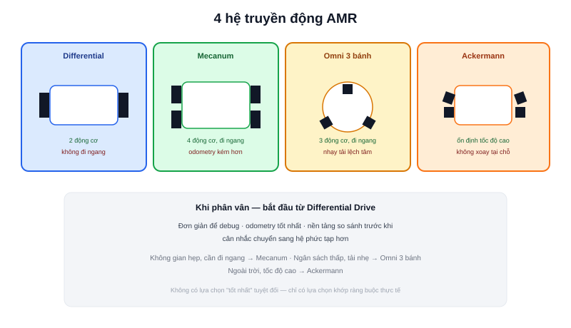

Chuyên mục [Động học Robot](/blog/dong-hoc-robot-di-chuyen-differential-drive-odometry) đã trình bày chi tiết công thức động học của [Differential Drive](/blog/dong-hoc-robot-di-chuyen-differential-drive-odometry) và [Mecanum Drive](/blog/dong-hoc-robot-mecanum). Bài này không lặp lại các công thức đó — nó đứng ở góc nhìn người thiết kế AMR, trả lời câu hỏi thực tế: với một bài toán vận chuyển cụ thể, nên chọn hệ truyền động nào?

## Differential Drive — mặc định hợp lý cho phần lớn AMR

Hai bánh chủ động, cơ khí đơn giản nhất, odometry chính xác nhất (bánh tiếp xúc sàn liên tục, không qua con lăn rời rạc như Mecanum). Nhược điểm: không đi ngang được, cần xoay đầu trước khi đổi hướng — trong không gian hẹp, việc xoay đầu liên tục làm chậm tốc độ di chuyển thực tế dù tốc độ tối đa danh nghĩa cao.

**Chọn khi:** không gian vận hành đủ rộng để xoay đầu, ưu tiên độ chính xác odometry và chi phí thấp — đây là lựa chọn mặc định hợp lý cho phần lớn dự án AMR mới bắt đầu (dự án Diff Robot trong showcase của trang này dùng cấu hình này).

## Mecanum Drive — đổi độ chính xác lấy khả năng đi ngang

Bốn bánh, di chuyển được mọi hướng kể cả đi ngang thuần tuý mà không cần xoay thân — cực kỳ giá trị trong không gian hẹp (kho hàng nhiều kệ sát nhau, hành lang chật). Đánh đổi: cơ khí phức tạp hơn, cần đồng bộ chính xác cả 4 bánh, và odometry kém tin cậy hơn do các con lăn nghiêng 45° dễ trượt hơn bánh thường.

**Chọn khi:** không gian vận hành hẹp, cần đỗ/lấy hàng từ bên hông thường xuyên (dự án Robot Mecanum và Atlas A2 trong showcase đều dùng cấu hình này cho đúng mục đích nghiên cứu chuyển động đa hướng).

## Omni-wheel 3 bánh (Kiwi Drive) — đa hướng với ít bánh hơn

Ba bánh omni (mỗi bánh có các con lăn nhỏ vuông góc quanh vành, khác với con lăn nghiêng 45° của Mecanum) đặt lệch nhau 120°, cũng cho khả năng di chuyển đa hướng tương tự Mecanum nhưng chỉ cần 3 động cơ thay vì 4 — giảm chi phí, giảm điểm hỏng hóc cơ khí. Đánh đổi: tải trọng phân bổ không đều (chỉ 3 điểm tiếp xúc thay vì 4), yêu cầu bố trí trọng tâm robot cẩn thận hơn để tránh lật khi tải nặng lệch tâm.

**Chọn khi:** cần đa hướng nhưng robot nhẹ, tải trọng nhỏ và cân đối — ít phổ biến hơn Mecanum trong AMR công nghiệp vì vấn đề tải trọng, nhưng phổ biến trong robot thi đấu (RoboCup) nhờ chi phí thấp hơn.

## Ackermann/Tricycle — mô phỏng lái xe hơi

Một bánh lái riêng (giống ô tô) điều khiển hướng, bánh còn lại chỉ chủ động về tốc độ — không thể xoay tại chỗ, bán kính quay tối thiểu lớn hơn hẳn ba loại trên. Đổi lại: ổn định hơn ở tốc độ cao, phù hợp AMR ngoài trời di chuyển quãng đường dài (khác môi trường trong nhà của các dự án showcase ở trang này).

**Chọn khi:** AMR vận hành ngoài trời, tốc độ cao, không cần xoay tại chỗ hay đi ngang — ít gặp trong AMR nhà kho/nhà máy, phổ biến hơn ở xe tự hành ngoài trời.

## Bảng quyết định nhanh

| Tiêu chí | Differential | Mecanum | Omni 3 bánh | Ackermann |
|---|---|---|---|---|
| Số động cơ | 2 | 4 | 3 | 2 (lái + kéo) |
| Đi ngang được? | Không | Có | Có | Không |
| Xoay tại chỗ? | Có | Có | Có | Không |
| Độ chính xác odometry | Cao nhất | Thấp hơn (trượt con lăn) | Trung bình | Cao |
| Độ phức tạp cơ khí | Thấp | Cao | Trung bình | Trung bình |
| Phù hợp nhất | Đa số AMR trong nhà | Không gian hẹp, cần đi ngang | Robot nhẹ, chi phí thấp | Ngoài trời, tốc độ cao |

> **Tóm lại:** Không có hệ truyền động "tốt nhất" — chỉ có lựa chọn khớp nhất với ràng buộc không gian vận hành, ngân sách, và yêu cầu độ chính xác định vị. Khi phân vân, Differential Drive là điểm khởi đầu an toàn nhất cho một dự án AMR mới — đơn giản để debug, dễ đạt odometry tốt, và là nền tảng để so sánh khi cân nhắc chuyển sang các hệ phức tạp hơn.
