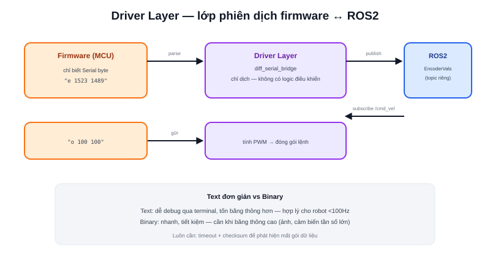

Bài [Bức tranh toàn cảnh phần mềm robot](/blog/buc-tranh-toan-canh-phan-mem-robot-ros2-slam-nav2) đặt "Giao tiếp" là lớp nằm giữa Firmware và ROS2. Đây chính là **Driver Layer** — không phải driver động cơ (đã nói ở bài [Motor Driver](/blog/motor-driver-cho-amr)), mà là driver phần mềm: đoạn code chạy trên máy tính chính (ROS2), đóng vai trò phiên dịch giữa giao thức riêng của firmware và hệ sinh thái topic/message chuẩn của ROS2.



## Vì sao cần một lớp phiên dịch riêng

Firmware (chạy trên MCU) và ROS2 (chạy trên SBC) là hai thế giới hoàn toàn khác nhau — MCU không biết gì về DDS, topic, hay message type của ROS2; nó chỉ biết đọc/ghi byte qua UART. Driver layer đứng giữa, làm hai việc:

```text
Chiều lên (firmware → ROS2):
    đọc dữ liệu thô qua Serial (ví dụ "e 1523 1489")
    → parse thành số → đóng gói thành message chuẩn (EncoderVals)
    → publish lên topic ROS2

Chiều xuống (ROS2 → firmware):
    subscribe /cmd_vel (message Twist chuẩn ROS2)
    → tính toán ra lệnh PWM cho từng bánh
    → đóng gói thành chuỗi lệnh text đơn giản (ví dụ "o 100 100")
    → gửi qua Serial xuống firmware
```

Đây đúng là kiến trúc đã dùng trong dự án Diff Robot (phần showcase của trang này): package `diff_serial_bridge` đọc/ghi qua Serial UART 57600 baud bằng một tập lệnh text đơn giản, dễ debug trực tiếp qua terminal.

## Thiết kế giao thức: text đơn giản hay binary?

| | Giao thức text | Giao thức binary |
|---|---|---|
| Dễ debug | Rất dễ — mở terminal serial, gõ tay lệnh, đọc được ngay | Khó — cần công cụ giải mã riêng |
| Băng thông | Tốn hơn (mỗi số là nhiều byte ASCII) | Tiết kiệm hơn (mỗi số vài byte cố định) |
| Tốc độ parse | Chậm hơn (phải parse chuỗi) | Nhanh hơn (đọc trực tiếp cấu trúc byte) |
| Phù hợp | Robot nhỏ, tần số giao tiếp vừa phải (dưới ~100Hz) | Robot cần băng thông cao, nhiều cảm biến tần số lớn |

Với phần lớn AMR cỡ nhỏ/vừa, giao thức text đơn giản (như ví dụ trên) là lựa chọn hợp lý — khả năng debug trực tiếp bằng cách gõ lệnh tay qua terminal serial trong lúc phát triển giá trị hơn nhiều so với vài phần trăm băng thông tiết kiệm được từ giao thức binary, trừ khi robot thực sự cần truyền lượng dữ liệu lớn (ví dụ ảnh camera) qua đúng kênh Serial đó.

> **Tóm lại:** Driver layer không chứa logic điều khiển (đó là việc của Nav2/PID) — nó chỉ có đúng một trách nhiệm: **dịch đúng, dịch đủ nhanh** giữa hai định dạng dữ liệu khác nhau. Trộn lẫn logic điều khiển vào lớp này (ví dụ tự ý làm mượt tốc độ trong driver thay vì để tầng trên quyết định) là một lỗi kiến trúc phổ biến, khiến hệ thống khó debug vì logic bị phân tán không rõ ràng.

## Type-safe message thay vì kiểu dữ liệu ROS2 chuẩn

Một chi tiết thiết kế đáng chú ý (cũng từ dự án Diff Robot): thay vì dùng thẳng kiểu dữ liệu ROS2 có sẵn cho dữ liệu encoder/lệnh động cơ, dự án định nghĩa **message type riêng** (`MotorCommand`, `EncoderVals`, `MotorVels` trong package `diff_serial_mgs`) — giúp giao diện giữa driver layer và các node khác rõ ràng đúng ngữ nghĩa (biết ngay `EncoderVals` chứa gì, thay vì phải đoán từ một kiểu dữ liệu chung chung), dễ mở rộng thêm field mà không phá vỡ code đang dùng kiểu dữ liệu chuẩn ở chỗ khác trong hệ thống.

## Độ trễ và mất gói: hai vấn đề luôn phải tính tới

Serial không đảm bảo dữ liệu tới đúng lúc, đúng thứ tự trong mọi trường hợp — nhiễu điện, cáp lỏng, hoặc buffer đầy có thể làm mất hoặc trễ một gói dữ liệu. Driver layer nghiêm túc luôn cần cơ chế phát hiện dữ liệu bất thường (timeout không nhận được phản hồi, checksum kiểm tra tính toàn vẹn của gói tin) — thiếu bước này, một lần mất gói dữ liệu đơn lẻ có thể khiến odometry lệch vĩnh viễn mà không có cách nào tự phát hiện.
