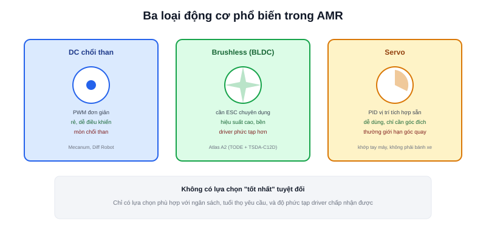

Bài [Kiến trúc phần cứng robot di động](/blog/kien-truc-phan-cung-robot-di-dong) đã đặt động cơ vào đúng vị trí trong sơ đồ khối tổng thể. Bài này tập trung riêng vào việc chọn **loại động cơ nào** — quyết định ảnh hưởng trực tiếp tới độ phức tạp mạch driver, tuổi thọ, và chi phí toàn hệ thống.

## DC chổi than (Brushed DC) — đơn giản, rẻ, phổ biến nhất ở robot DIY

Cấu tạo đơn giản nhất: chỉ cần cấp đúng điện áp là quay, đổi cực để đổi chiều. Bộ chuyển mạch cơ khí (chổi than + cổ góp) bên trong tự động đảo chiều dòng điện qua cuộn dây theo đúng thời điểm để duy trì mô-men quay — không cần mạch điều khiển phức tạp bên ngoài.

- **Ưu điểm:** rẻ, dễ điều khiển (chỉ cần PWM + chiều), dễ mua linh kiện thay thế
- **Nhược điểm:** chổi than mòn dần theo thời gian (tuổi thọ hữu hạn, cần bảo trì định kỳ), sinh nhiễu điện từ (tia lửa điện tại điểm tiếp xúc chổi than), hiệu suất thấp hơn BLDC cùng công suất

Đây là loại động cơ dùng trong cả hai dự án robot Mecanum và Diff Robot ở phần showcase của trang này (GA25 DC Motor) — lựa chọn hợp lý cho robot cỡ nhỏ, ngân sách hạn chế, không cần vận hành liên tục hàng nghìn giờ.

## Brushless DC (BLDC) — không chổi than, hiệu suất cao hơn, cần driver phức tạp hơn

Loại bỏ hoàn toàn bộ chuyển mạch cơ khí — thay vào đó, một mạch điện tử (ESC — Electronic Speed Controller) đảm nhiệm việc đổi chiều dòng điện qua các cuộn dây theo đúng thời điểm, dựa trên vị trí rotor đọc được (qua cảm biến Hall hoặc ước lượng cảm ứng ngược - sensorless).

- **Ưu điểm:** không mòn chổi than (tuổi thọ cao hơn nhiều), hiệu suất cao hơn, ít nhiễu điện từ hơn, mô-men ổn định hơn ở tốc độ cao
- **Nhược điểm:** bắt buộc cần ESC/driver chuyên dụng (không thể chạy trực tiếp bằng PWM đơn giản như DC chổi than), giá thành cao hơn

Robot Atlas A2 (phần showcase dự án) dùng động cơ TODE brushless qua driver TSDA-C12D — lựa chọn hợp lý khi robot cần vận hành liên tục, tải nặng hơn, và đã có ngân sách cho driver chuyên dụng.

## Servo Motor — có sẵn vòng điều khiển vị trí bên trong

Về bản chất là một động cơ DC (thường brushed, đôi khi BLDC) **đã tích hợp sẵn** encoder + mạch điều khiển PID vị trí bên trong cùng một khối — bạn chỉ cần gửi tín hiệu "muốn ở góc/vị trí nào", servo tự lo phần còn lại. Phổ biến ở tay máy robot (mobile manipulator, đã nhắc ở bài [Các loại AMR](/blog/cac-loai-amr)) hơn là ở bánh xe di chuyển liên tục — vì servo tiêu chuẩn thường giới hạn góc quay (không quay liên tục vô hạn như bánh xe cần).

> **Tóm lại:** DC chổi than phù hợp khi cần đơn giản, rẻ, dễ sửa; BLDC phù hợp khi cần hiệu suất cao, vận hành liên tục lâu dài; Servo phù hợp cho khớp cần giữ đúng một vị trí/góc, không phải bánh xe quay liên tục. Không có lựa chọn "tốt nhất" tuyệt đối — chỉ có lựa chọn phù hợp nhất với ngân sách và yêu cầu vận hành cụ thể.

## Bảng so sánh nhanh

| Tiêu chí | DC chổi than | BLDC | Servo |
|---|---|---|---|
| Độ phức tạp driver | Thấp (PWM + chiều) | Cao (ESC chuyên dụng) | Thấp (đã tích hợp sẵn) |
| Tuổi thọ | Trung bình (mòn chổi than) | Cao | Tuỳ loại bên trong |
| Chi phí | Thấp | Trung bình – cao | Trung bình |
| Phù hợp | Robot DIY, tải nhẹ-trung bình | Tải nặng, vận hành liên tục | Khớp tay máy, cơ cấu cần giữ góc |

Bài [Chọn Motor cho AMR](/blog/chon-motor-cho-amr) ở chuyên mục Thiết kế AMR thực tế sẽ đi tiếp vào cách tính toán mô-men/tốc độ cần thiết dựa trên khối lượng robot thực tế, thay vì chỉ so sánh định tính giữa các loại như bài này.
