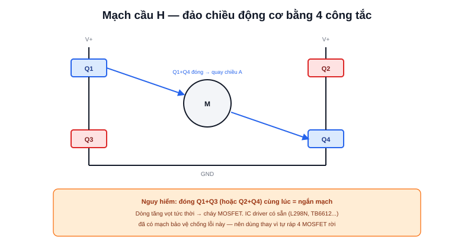

Bài [Kiến trúc phần cứng](/blog/kien-truc-phan-cung-robot-di-dong) đã nêu vai trò của Motor Driver: cầu nối giữa tín hiệu điều khiển yếu (từ MCU) và dòng điện lớn (để quay động cơ thật). Bài này đi vào cụ thể driver hoạt động thế nào, và cách chọn đúng driver theo loại động cơ đã bàn ở bài [Động cơ cho AMR](/blog/dong-co-cho-amr).



## Mạch cầu H (H-Bridge) — driver cho động cơ DC chổi than

Bốn công tắc điện tử (thường là MOSFET) xếp thành hình chữ H, động cơ nằm ở giữa. Đóng/mở đúng cặp công tắc chéo nhau cho phép dòng điện chạy qua động cơ theo **một trong hai chiều** — đây là cách một driver đơn giản vừa quay được động cơ vừa đảo được chiều quay, chỉ với 2 tín hiệu điều khiển (PWM tốc độ + chiều quay) từ MCU.

```text
Đóng Q1 + Q4  →  dòng chạy trái→phải qua động cơ  →  quay chiều A
Đóng Q2 + Q3  →  dòng chạy phải→trái qua động cơ  →  quay chiều B
Đóng Q1 + Q3 (hoặc Q2 + Q4)  →  ngắn mạch — TUYỆT ĐỐI không được xảy ra
```

Trường hợp cuối là lỗi thiết kế/lập trình nguy hiểm nhất với mạch cầu H — đóng nhầm cặp công tắc cùng phía tạo đường ngắn mạch trực tiếp từ nguồn xuống đất, dòng điện tăng vọt trong tích tắc, thường cháy MOSFET ngay lập tức. Các IC driver tích hợp sẵn (L298N, TB6612, BTS7960...) đã có mạch bảo vệ chống tình huống này — lý do nên dùng IC có sẵn thay vì tự ráp 4 MOSFET rời khi mới bắt đầu.

## ESC — driver chuyên dụng cho động cơ Brushless

Với động cơ BLDC (đã nói ở bài Động cơ), việc đảo chiều dòng qua 3 cuộn dây theo đúng thời điểm (dựa trên vị trí rotor) phức tạp hơn nhiều so với 1 cặp công tắc đơn giản — cần một vi điều khiển nhỏ ngay trên mạch ESC để tính toán liên tục. Đây là lý do ESC luôn là một mạch "thông minh" độc lập, không đơn thuần là 4 công tắc như H-Bridge.

> **Tóm lại:** Chọn driver phải khớp đúng loại động cơ — H-Bridge/IC driver dành cho DC chổi than, ESC dành cho BLDC. Lắp nhầm (ví dụ cố chạy động cơ BLDC bằng driver H-Bridge thường) sẽ không quay được đúng cách, vì driver không biết cách đảo pha 3 cuộn dây theo đúng vị trí rotor.

## Chọn dòng chịu tải — sai số phổ biến nhất khi tự ráp robot

Thông số quan trọng nhất khi chọn driver là **dòng chịu tải liên tục** (continuous current rating), không phải dòng đỉnh (peak current) ghi to trên datasheet:

```text
Dòng khởi động (stall current) của động cơ DC thường gấp 5-10 lần
dòng hoạt động bình thường — xảy ra mỗi khi động cơ khởi động đột ngột
hoặc bị chặn cứng (kẹt bánh vào vật cản)
```

Driver chỉ ghi "dòng đỉnh 10A trong 10 giây" nhưng dòng chịu tải liên tục thực tế có thể chỉmax 3-5A — chọn driver theo đúng con số dòng đỉnh ghi to trên vỏ hộp mà bỏ qua dòng liên tục là nguyên nhân phổ biến khiến driver nóng chảy/hỏng sau vài phút vận hành thực tế, dù test nhanh ban đầu (vài giây) vẫn chạy bình thường.

## Bảng driver phổ biến theo cỡ robot

| Driver | Dòng liên tục | Phù hợp |
|---|---|---|
| L298N | ~1-2A/kênh (thực tế, dù ghi 2A) | Robot DIY nhỏ, giáo dục |
| TB6612FNG | ~1.2A/kênh | Robot nhỏ, hiệu suất tốt hơn L298N |
| BTS7960 | ~30-40A/kênh | Robot tải trung bình-nặng |
| ESC BLDC (tuỳ dòng) | Theo watt động cơ | Động cơ brushless công suất lớn |

Nguyên tắc an toàn: luôn chọn driver có dòng chịu tải liên tục **cao hơn ít nhất 20-30%** so với dòng hoạt động bình thường tính toán được của động cơ — chừa biên độ dự phòng cho những lúc tải tăng đột biến (leo dốc nhẹ, khởi động đột ngột) mà không đẩy driver vào vùng quá tải liên tục.
