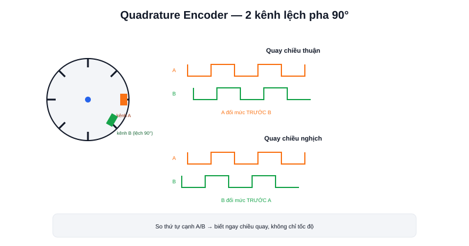

Bài [Odometry trong Localization](/blog/odometry-trong-localization) giả định robot đã có sẵn dữ liệu "bánh xe vừa quay bao nhiêu vòng". **Encoder** là cảm biến tạo ra chính xác dữ liệu đó — gắn liền trục động cơ hoặc bánh xe, đếm số xung phát ra để suy ra góc quay.



## Nguyên lý cơ bản: đếm xung

Một đĩa quay gắn liền trục động cơ, có các rãnh hoặc vạch chia đều quanh chu vi. Một cảm biến cố định (quang học hoặc từ) phát hiện mỗi lần một rãnh/vạch đi qua, phát ra một xung điện. Đếm số xung trong một khoảng thời gian, biết trước số xung mỗi vòng quay (độ phân giải encoder), suy ra được tốc độ quay:

```text
tốc_độ_quay = (số_xung_đếm_được / số_xung_mỗi_vòng) / thời_gian
```

## Incremental vs Absolute — biết "vừa quay bao nhiêu" hay biết "đang ở góc nào"

- **Incremental encoder** — chỉ đếm xung tương đối, biết "vừa quay thêm bao nhiêu" kể từ lần đọc trước — không biết vị trí góc tuyệt đối lúc mới bật nguồn. Rẻ hơn, phổ biến hơn nhiều trong AMR vì bánh xe chỉ cần biết đã quay bao xa (đủ cho odometry), không cần biết góc tuyệt đối
- **Absolute encoder** — mỗi vị trí góc có một mã nhị phân riêng biệt, đọc được ngay góc tuyệt đối kể cả vừa mới bật nguồn, không cần "quy về 0" trước. Đắt hơn, dùng chủ yếu ở khớp tay máy (nơi cần biết chính xác góc khớp ngay khi khởi động, không thể chờ hiệu chỉnh)

Tuyệt đại đa số encoder gắn ở bánh xe AMR là loại incremental — vì bài toán odometry chỉ cần "đã đi thêm bao xa", không cần "bánh đang ở góc tuyệt đối nào".

## Quadrature encoder — hai kênh để biết cả chiều quay

Một encoder chỉ có 1 kênh xung chỉ biết **tốc độ** quay, không biết **chiều** quay (không phân biệt được đang quay tiến hay lùi chỉ từ đếm số xung). Quadrature encoder giải quyết bằng cách dùng **hai kênh A và B**, đặt lệch pha nhau 90°:

```text
Quay chiều thuận:  kênh A đổi mức TRƯỚC kênh B
Quay chiều nghịch: kênh B đổi mức TRƯỚC kênh A
```

So sánh thứ tự cạnh lên/xuống giữa hai kênh cho biết ngay chiều quay — đây là lý do gần như mọi encoder dùng trong odometry AMR đều là loại quadrature 2 kênh, không phải loại 1 kênh đơn giản.

> **Tóm lại:** Độ phân giải encoder (số xung/vòng) quyết định độ mượt và độ chính xác của odometry — độ phân giải càng cao, ước lượng vị trí càng mượt ở tốc độ thấp. Nhưng độ phân giải cao không sửa được vấn đề cốt lõi đã nói ở bài Odometry: **sai số vẫn tích luỹ theo thời gian** dù encoder có chính xác tới đâu, vì bản chất odometry vẫn là dead reckoning.

## Vị trí gắn encoder: trên trục động cơ hay trên bánh xe?

```text
Gắn trên trục động cơ (trước hộp số):
  + độ phân giải hiệu dụng cao hơn (nhân thêm tỉ số truyền hộp số)
  − không phát hiện được trượt giữa hộp số và bánh xe (hiếm nhưng có thể xảy ra)

Gắn trực tiếp trên trục bánh xe (sau hộp số):
  + phản ánh đúng chuyển động thực tế của bánh xe
  − độ phân giải hiệu dụng thấp hơn (không được nhân thêm tỉ số truyền)
```

Phần lớn robot DIY gắn encoder ngay trên trục động cơ (trước hộp số) vì đơn giản về cơ khí và tận dụng được độ phân giải cao hơn — miễn là hộp số đủ tin cậy, không trượt răng trong điều kiện vận hành bình thường.
