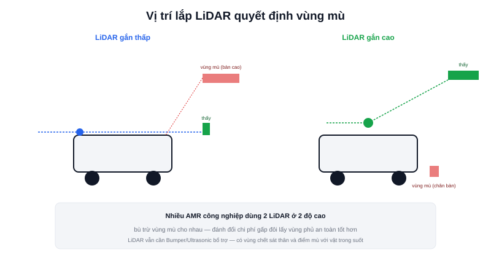

Bài [Kiến trúc phần cứng](/blog/kien-truc-phan-cung-robot-di-dong) đã liệt kê LiDAR trong bảng cảm biến. Bài này tập trung vào câu hỏi thực tế hơn: LiDAR đóng vai trò gì trong toàn bộ chuỗi xử lý của một AMR, và tại sao vị trí lắp đặt trên khung robot lại quan trọng đến vậy.



## Một cảm biến, hai vai trò khác nhau

Cùng một dòng dữ liệu LiDAR (`sensor_msgs/LaserScan`) được dùng cho hai mục đích khác nhau trong Nav2:

- **SLAM/AMCL** (tần số xử lý thấp hơn, nhưng cần độ chính xác cao) — so khớp scan với bản đồ đã biết để định vị, hoặc dựng bản đồ mới
- **Local costmap/né vật cản** (tần số xử lý cao, cần phản hồi tức thời) — phát hiện vật cản ngay trước mặt để né kịp thời, không cần độ chính xác bản đồ tuyệt đối, chỉ cần "có gì đó ở đây, tránh ra"

Đây là lý do LiDAR thường được coi là cảm biến "bắt buộc phải có" trên AMR — không cảm biến nào khác cùng lúc phục vụ tốt cả hai vai trò này với cùng một dòng dữ liệu.

## Vị trí lắp đặt quyết định vùng mù

LiDAR 2D quét một mặt phẳng duy nhất, ở đúng độ cao nó được gắn — bất kỳ vật thể nào không cắt ngang mặt phẳng đó đều là **vùng mù** hoàn toàn với robot:

```text
LiDAR gắn thấp (gần sàn):
  + phát hiện tốt vật cản thấp (chân bàn ghế, bậc thềm)
  − không thấy vật cản cao hơn (mép bàn, quầy kệ đưa ra)

LiDAR gắn cao (ngang thân robot):
  + phát hiện tốt vật cản ở tầm người, tầm giá đỡ hàng hoá
  − không thấy vật cản thấp (chân bàn, dây điện trên sàn)
```

Nhiều AMR công nghiệp thực tế dùng **2 LiDAR ở hai độ cao khác nhau** (một thấp, một cao) chính để bù trừ vùng mù cho nhau — đánh đổi chi phí cảm biến gấp đôi lấy vùng phủ an toàn tốt hơn nhiều, đặc biệt quan trọng ở môi trường có người qua lại.

## Góc quét 360° hay chỉ một phần phía trước?

```text
LiDAR quét 360° (gắn giữa/trên nóc robot): thấy vật cản mọi hướng
  → cần thiết cho SLAM (cần thấy toàn cảnh môi trường xung quanh để dựng bản đồ đúng)

LiDAR quét góc hẹp phía trước: chỉ đủ né vật cản khi đi thẳng
  → không đủ cho SLAM chất lượng cao, nhưng rẻ hơn nếu chỉ cần né vật cản cơ bản
```

Hầu hết LiDAR dùng cho AMR (RPLidar, YDLidar — đã xuất hiện trong các dự án showcase của trang này) quét đủ 360° bằng cách xoay toàn bộ cụm phát-thu, đủ dữ liệu cho cả SLAM lẫn né vật cản mọi hướng, kể cả phía sau.

> **Tóm lại:** Chọn LiDAR không chỉ là chọn tầm quét (range) hay tần số quét (Hz) — vị trí lắp đặt trên khung robot ảnh hưởng trực tiếp tới việc robot "nhìn thấy" loại vật cản nào trong môi trường vận hành thực tế. Bài [Chọn LiDAR](/blog/chon-lidar-cho-amr) ở chuyên mục Thiết kế AMR thực tế sẽ đi vào cách chọn cụ thể theo tầm quét, tần số, và ngân sách.

## Không thay thế hoàn toàn Bumper và Ultrasonic

Dù mạnh, LiDAR vẫn có điểm mù ngay sát thân robot (khoảng cách tối thiểu đo được — dead zone) và không phát hiện được vật liệu trong suốt (kính) hay hấp thụ ánh sáng hồng ngoại mạnh. Đây là lý do AMR nghiêm túc luôn kết hợp thêm cảm biến va chạm vật lý (bumper) làm lớp bảo vệ cuối cùng — bàn kỹ ở bài [Bumper và Emergency Stop](/blog/bumper-va-emergency-stop) tiếp theo.
