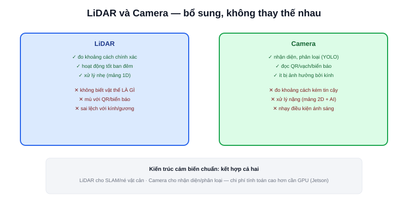

Bài [LiDAR trong kiến trúc AMR](/blog/lidar-trong-kien-truc-amr) đã nói LiDAR là cảm biến chính cho SLAM và né vật cản. Nhưng LiDAR có một giới hạn cố hữu: nó chỉ trả lời "có vật thể ở đó, cách bao xa" — hoàn toàn không biết **vật thể đó là gì**. Camera lấp đúng khoảng trống này.

## Việc LiDAR không làm được, Camera làm được

- **Phân loại vật thể** — LiDAR thấy "có khối hình chữ nhật cách 2m", camera + mô hình nhận diện (YOLO, đã nhắc trong nội dung dự án [Atlas A2](/du-an/atlas-a2)) biết đó là "người" hay "thùng carton" hay "xe đẩy hàng" — thông tin quan trọng để quyết định cách phản ứng (người cần né rộng hơn, thùng carton tĩnh có thể đi sát hơn)
- **Đọc thông tin trực quan** — mã QR/vạch dán trên sàn hoặc kệ hàng, biển báo, đèn tín hiệu — LiDAR hoàn toàn mù với các loại dữ liệu 2D phẳng này
- **Nhận diện vật liệu trong suốt/phản chiếu** — kính, gương phản xạ tia laser của LiDAR sai lệch hoặc xuyên qua hoàn toàn; camera (dùng ánh sáng nhìn thấy thông thường) ít bị ảnh hưởng hơn nhiều với những vật liệu này

## Đánh đổi: Camera không đo khoảng cách trực tiếp tốt như LiDAR

Camera đơn (monocular) không tự đo được khoảng cách tuyệt đối — chỉ ước lượng gián tiếp qua kích thước vật thể trong khung hình (cần biết trước kích thước thật) hoặc qua các kỹ thuật thị giác máy tính phức tạp hơn (visual odometry, structure from motion). Camera stereo (2 ống kính, giống mắt người) đo được độ sâu (depth) trực tiếp bằng tam giác đạc thị sai — tương tự nguyên lý LiDAR triangulation đã nói ở nội dung dự án Diff Robot, nhưng dùng hai ảnh 2D thay vì laser.

> **Tóm lại:** LiDAR trả lời "cái gì đó ở đâu, cách bao xa" rất chính xác nhưng mù về bản chất vật thể; Camera trả lời "đó là cái gì" rất tốt nhưng đo khoảng cách kém tin cậy hơn (trừ khi dùng loại stereo/depth chuyên dụng). Kết hợp cả hai — không chọn một trong hai — là kiến trúc cảm biến chuẩn cho AMR nghiêm túc.

## USB UVC — cách tích hợp đơn giản nhất

Phần lớn camera dùng trong AMR DIY là loại USB UVC chuẩn (v4l2 trên Linux) — cắm là dùng ngay, không cần driver riêng, dữ liệu ảnh đọc trực tiếp qua OpenCV hoặc package `usb_cam` trong ROS2. Đây chính là loại camera dùng trong dự án Atlas A2 (phần showcase của trang này) — stream video qua API, xử lý bằng YOLOv8 để nhận diện vật thể thời gian thực.

## Chi phí tính toán: điểm khác biệt lớn với LiDAR

Xử lý dữ liệu LiDAR (một mảng khoảng cách 1D theo góc) nhẹ hơn nhiều so với xử lý ảnh camera (mảng pixel 2D, đặc biệt khi chạy qua mô hình nhận diện AI). Đây là lý do robot chỉ dùng LiDAR (như Robot Mecanum, Diff Robot trong showcase) chạy tốt trên Raspberry Pi 4, trong khi robot có thêm camera + YOLO (như Atlas A2) cần nâng cấp lên máy tính có GPU (Jetson Orin Nano) mới xử lý đủ nhanh theo thời gian thực — đúng như đã phân tích trong nội dung dự án đó.
