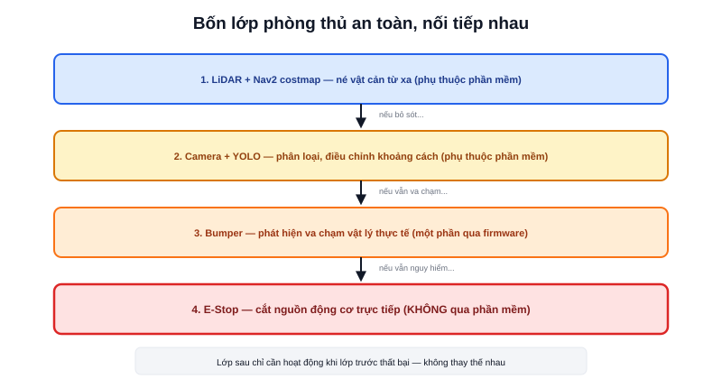

Các bài trước — [LiDAR](/blog/lidar-trong-kien-truc-amr), [Camera](/blog/camera-trong-amr) — đều là cảm biến "thông minh", dữ liệu phải qua xử lý phần mềm mới ra được quyết định né tránh. Nhưng phần mềm có thể treo, thuật toán có thể nhận diện sai, và không cảm biến nào phủ được 100% vùng quanh robot. Bumper và Emergency Stop là hai lớp an toàn được thiết kế để hoạt động **độc lập hoàn toàn** với mọi phần mềm phía trên.



## Bumper — cảm biến va chạm vật lý, không cần "hiểu" gì cả

Bumper là dải cảm biến cơ khí (thường dùng công tắc vi mô hoặc cảm biến áp lực) chạy dọc theo mép ngoài robot — khi robot **thực sự chạm** vào vật cản (dù LiDAR/camera đã bỏ sót vì lý do gì đó), bumper bị nén và kích hoạt tín hiệu dừng ngay lập tức.

Điểm khác biệt cốt lõi so với LiDAR/camera: bumper không cần "hiểu" vật cản là gì, không cần thuật toán xử lý phức tạp — chỉ đơn giản là một công tắc cơ khí đóng/mở. Đây chính xác là loại cảm biến ESP32 xử lý va chạm trong dự án Atlas A2 (phần showcase của trang này) đảm nhiệm, tách biệt hoàn toàn khỏi luồng xử lý LiDAR/Nav2 phức tạp hơn.

> **Tóm lại:** Bumper là lớp an toàn "chạm mới biết" — luôn xảy ra **sau** khi các cảm biến khoảng cách (LiDAR, ultrasonic) đã có cơ hội phản ứng trước. Nó không thay thế được việc né vật cản chủ động bằng LiDAR, mà là lưới an toàn cuối cùng khi việc né đó thất bại.

## Emergency Stop — mạch cứng, không đi qua phần mềm

**E-Stop** (thường là nút bấm đỏ nấm, dễ nhận biết, dễ bấm trong tình huống khẩn) khi kích hoạt phải **cắt trực tiếp nguồn cấp cho driver động cơ** — không đi qua bất kỳ đoạn code nào xử lý logic "nên dừng hay không". Đây là nguyên tắc thiết kế an toàn cơ bản nhất: nếu E-Stop phải chờ phần mềm xử lý mới dừng được, thì nó không còn là "khẩn cấp" nữa — một phần mềm treo, một vòng lặp vô hạn, hay một lỗi logic bất kỳ đều có thể khiến robot không dừng lại kịp lúc cần thiết nhất.

```text
Luồng bình thường:  Nav2 tính lệnh → /cmd_vel → firmware → PWM → động cơ
                     (đi qua rất nhiều lớp phần mềm, mỗi lớp đều có thể lỗi)

Luồng E-Stop:        Nút bấm → relay/công tắc cơ khí → cắt nguồn động cơ trực tiếp
                     (không đi qua lớp phần mềm nào)
```

Cả hai robot Mecanum và Atlas A2 trong phần showcase dự án của trang này đều có nút E-Stop vật lý riêng biệt trên khung — không phải tính năng phần mềm, mà là một mạch điện độc lập nối thẳng vào đường cấp nguồn động cơ.

## Vì sao không thể chỉ dựa vào phần mềm để dừng khẩn cấp

Xét lại bài [Giới hạn gia tốc](/blog/gioi-han-gia-toc-trong-dieu-khien-robot) đã nói: "dừng ngay lập tức" trong phần mềm bình thường có nghĩa là giảm tốc dần theo gia tốc âm tối đa — không phải dừng tức thời. Trong tình huống thực sự nguy hiểm (người đứng ngay trước robot, robot mất kiểm soát), thời gian giảm tốc dần đó — dù chỉ vài trăm mili-giây — vẫn là quá lâu. E-Stop tồn tại chính xác để bỏ qua toàn bộ logic giảm tốc "văn minh" đó, chấp nhận dừng đột ngột (dù giật, dù không "đẹp" về mặt điều khiển) để ưu tiên tuyệt đối cho an toàn.

## Bảng phân tầng an toàn

| Lớp | Phát hiện gì | Phản ứng | Phụ thuộc phần mềm? |
|---|---|---|---|
| LiDAR + Nav2 costmap | Vật cản từ xa | Tính lại đường đi, giảm tốc | Có — toàn bộ |
| Camera + YOLO | Phân loại vật cản (người/vật) | Điều chỉnh khoảng cách an toàn | Có — toàn bộ |
| Bumper | Va chạm vật lý thực tế | Dừng khẩn cấp | Một phần (thường vẫn qua firmware, nhưng ưu tiên cao) |
| E-Stop | Người vận hành bấm nút | Cắt nguồn động cơ | Không — mạch cứng thuần tuý |

Bốn lớp này không thay thế nhau — chúng là các tuyến phòng thủ nối tiếp, lớp sau chỉ cần hoạt động khi lớp trước đã thất bại vì bất kỳ lý do gì.
