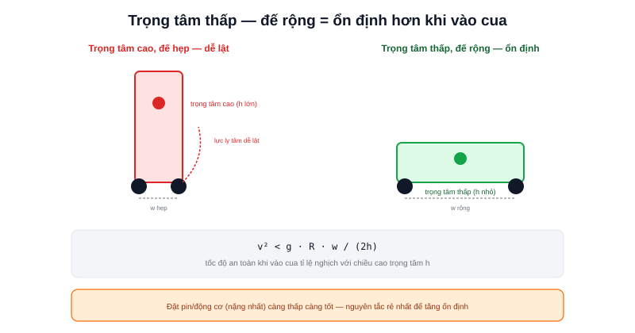

Đây là bài mở đầu chuyên mục Thiết kế AMR thực tế — trước khi đi vào chọn từng linh kiện cụ thể (Motor, Encoder, LiDAR, Computer, Battery ở các bài sau), cần đặt đúng nền móng cơ khí. Một robot có động cơ mạnh, LiDAR xịn, nhưng trọng tâm đặt sai vẫn có thể lật ở khúc cua đầu tiên.



## Trọng tâm (Center of Gravity) — yếu tố quyết định độ ổn định

Trọng tâm càng thấp và càng gần giữa đế robot (support polygon — đa giác tạo bởi các điểm tiếp xúc bánh xe với sàn), robot càng khó bị lật khi tăng/giảm tốc đột ngột hoặc vào cua. Nguyên tắc thực tế khi bố trí linh kiện:

```text
Đặt các khối nặng nhất (pin, động cơ) càng THẤP càng tốt, gần sàn
Đặt các khối nhẹ (mạch điều khiển, cảm biến) ở tầng trên
Tránh đặt tải lệch hẳn về một phía — robot chở hàng cần tính cả
    trọng tâm của HÀNG đang chở, không chỉ trọng tâm robot rỗng
```

Cả hai dự án Robot Mecanum và Atlas A2 trong phần showcase của trang này đặt pin ở tầng dưới cùng của khung — chính xác theo nguyên tắc này, không phải ngẫu nhiên.

## Điều kiện không lật khi vào cua

Về mặt vật lý, robot không lật khi lực ly tâm lúc quay vòng không đủ để "lật úp" quanh mép của support polygon:

```text
m·v²/R × h < m·g × (w/2)

trong đó: v = tốc độ, R = bán kính cua, h = chiều cao trọng tâm,
          w = bề rộng đế robot (khoảng cách 2 bánh)
```

Rút gọn: `v² < g·R·w / (2h)` — tốc độ tối đa an toàn khi vào cua tỉ lệ nghịch với chiều cao trọng tâm `h`. Robot cao và hẹp (trọng tâm cao, đế hẹp) phải giảm tốc độ nhiều hơn đáng kể khi vào cua so với robot thấp và rộng cùng khối lượng.

> **Tóm lại:** Hạ thấp trọng tâm và mở rộng đế robot (trong giới hạn không gian vận hành cho phép) là hai đòn bẩy cơ khí rẻ nhất để tăng tốc độ vào cua an toàn — rẻ hơn nhiều so với việc bù bằng thuật toán giới hạn tốc độ phần mềm (đã nói ở bài [Giới hạn gia tốc](/blog/gioi-han-gia-toc-trong-dieu-khien-robot)), vốn chỉ giải quyết được phần "làm chậm lại", không giải quyết được giới hạn vật lý gốc.

## Khoảng sáng gầm (Ground Clearance)

Khoảng cách từ điểm thấp nhất của khung tới mặt sàn — quá thấp, robot mắc kẹt ở ngưỡng cửa, khe co giãn sàn, hoặc vật cản nhỏ (dây điện, rác); quá cao, trọng tâm bị đẩy lên, giảm độ ổn định vừa nói ở trên, đồng thời tăng mô-men cần thiết để leo qua chênh lệch độ cao đó. Giá trị thực tế phổ biến cho AMR trong nhà: 15-30mm — đủ vượt ngưỡng cửa/khe sàn tiêu chuẩn mà không đội trọng tâm lên quá nhiều.

## Bố trí bánh xe: hình vuông/chữ nhật hay tam giác?

- **Bố trí hình vuông/chữ nhật (4 bánh)** — ổn định nhất, support polygon lớn nhất với cùng kích thước tổng thể, nhưng cần đảm bảo cả 4 bánh cùng tiếp xúc sàn (sàn không phẳng tuyệt đối có thể khiến 1 bánh hõng, mất lực bám) — cần hệ treo (suspension) đơn giản hoặc thiết kế khung có độ đàn hồi nhẹ để bù
- **Bố trí tam giác (3 bánh)** — luôn đảm bảo cả 3 điểm tiếp xúc sàn (3 điểm luôn tạo thành một mặt phẳng, không cần hệ treo), nhưng support polygon nhỏ hơn ở một số hướng, kém ổn định hơn theo hướng vuông góc với cạnh tam giác gần trọng tâm nhất

Robot Mecanum 4 bánh trong showcase của trang này cần thiết kế khung đủ cứng vững để cả 4 bánh tiếp xúc đều — đây là lý do các robot Mecanum thực tế thường có khung kim loại dày, ít lựa chọn khung nhựa in 3D mỏng như một số robot 3 bánh đơn giản hơn.

## Vật liệu khung: nhôm, thép, hay nhựa/mica?

| Vật liệu | Ưu điểm | Nhược điểm |
|---|---|---|
| Nhôm định hình (aluminum extrusion) | Nhẹ, cứng vững, dễ tháo lắp/mở rộng | Chi phí cao hơn mica |
| Thép | Cứng vững nhất, chịu tải nặng | Nặng, dễ gỉ nếu không xử lý bề mặt |
| Mica/Acrylic | Rẻ, dễ gia công (cắt laser), nhẹ | Giòn, dễ nứt khi va chạm mạnh |
| Nhựa in 3D | Tuỳ biến hình dạng tự do, rất rẻ cho robot nhỏ | Độ bền cơ học thấp, không phù hợp tải nặng |

Với robot nghiên cứu cỡ nhỏ (như các dự án showcase ở trang này), mica cắt laser hoặc nhôm định hình là lựa chọn phổ biến nhất — cân bằng giữa chi phí, độ cứng vững, và khả năng chỉnh sửa thiết kế qua nhiều vòng lặp phát triển.

Bài tiếp theo trong chuyên mục sẽ đi vào cách tính toán cụ thể momen/tốc độ động cơ cần thiết dựa trên khối lượng và ma sát của khung đã thiết kế ở bài này.
