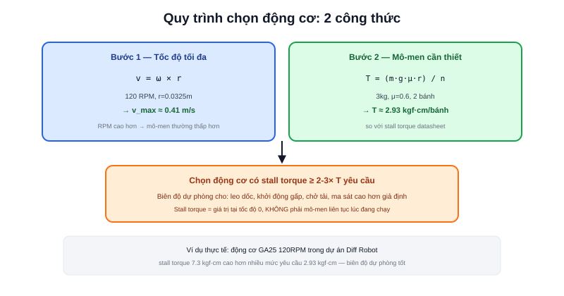

Bài [Động cơ cho AMR](/blog/dong-co-cho-amr) đã so sánh định tính giữa DC chổi than, BLDC, và Servo. Câu hỏi tiếp theo khi thiết kế thực tế: với robot khối lượng đã biết (từ bài [Thiết kế cơ khí](/blog/thiet-ke-co-khi-cho-amr)), cần động cơ **thông số bao nhiêu** mới đủ chạy? Chỉ cần hai phép tính.



## Bước 1: Tốc độ tối đa từ RPM động cơ

```text
v_max = ω × r = (2π × RPM / 60) × r
```

Ví dụ với bánh xe bán kính `r = 0.0325m` (65mm đường kính, kích thước phổ biến cho robot cỡ nhỏ), động cơ 120 RPM:

```text
ω = 2π × 120 / 60 ≈ 12.57 rad/s
v_max = 12.57 × 0.0325 ≈ 0.41 m/s  (≈ 1.47 km/h)
```

Đây đúng là phép tính đã dùng trong nội dung dự án Diff Robot (phần showcase của trang này) — động cơ GA25 120RPM cho tốc độ tối đa lý thuyết ~0.41 m/s. Muốn robot nhanh hơn, cần RPM cao hơn hoặc bánh xe lớn hơn — nhưng RPM cao hơn thường đi kèm mô-men thấp hơn (đánh đổi cố hữu của động cơ DC), cần kiểm tra lại bước 2.

## Bước 2: Kiểm tra mô-men đủ để di chuyển

Mô-men cần thiết để thắng ma sát lăn và khởi động robot từ đứng yên:

```text
T_yêu_cầu = (m × g × μ × r) / n_bánh_dẫn_động
```

Trong đó `m` = khối lượng robot (kg), `g` = 9.8 m/s², `μ` = hệ số ma sát lăn (thường 0.5-0.7 cho bánh cao su trên sàn phẳng), `r` = bán kính bánh, `n` = số bánh chủ động.

Ví dụ robot 3kg, μ = 0.6, 2 bánh chủ động (differential drive):

```text
T_yêu_cầu = (3 × 9.8 × 0.6 × 0.0325) / 2 ≈ 0.287 N·m ≈ 2.93 kgf·cm/bánh
```

So sánh với mô-men khoá trục (stall torque) ghi trên datasheet động cơ — cần **cao hơn đáng kể** mức yêu cầu tính được, không chỉ vừa đủ.

> **Tóm lại:** Mô-men khoá trục (stall torque) trên datasheet là giá trị tại tốc độ 0 (động cơ bị chặn cứng) — không phải mô-men liên tục khi đang quay ở tốc độ định mức, vốn thấp hơn đáng kể theo đường cong torque-speed của động cơ DC. So sánh trực tiếp `T_yêu_cầu` với stall torque chỉ mang tính tham khảo sơ bộ ban đầu — biên độ dự phòng nên rộng rãi (thực tế thường chọn động cơ có stall torque gấp 2-3 lần mức tính toán tối thiểu), không dựa vào so sánh sát nút.

## Vì sao cần biên độ dự phòng lớn

Công thức trên chưa tính tới các tình huống tải nặng hơn điều kiện lý tưởng:

```text
- Leo dốc nhẹ (thêm thành phần trọng lực dọc theo mặt dốc)
- Khởi động đột ngột (cần mô-men tức thời cao hơn mô-men duy trì tốc độ đều)
- Chở thêm tải (khối lượng m tăng lên so với robot rỗng)
- Sàn không hoàn toàn phẳng, ma sát μ cao hơn giả định
```

Đây là lý do trong thực tế, kỹ sư thường chọn động cơ có mô-men khoá trục gấp 2-3 lần mức `T_yêu_cầu` tính toán tối thiểu — không phải vì công thức sai, mà vì công thức chỉ mô tả điều kiện lý tưởng, còn vận hành thực tế luôn khắc nghiệt hơn.

## Bảng tổng hợp quy trình

| Bước | Công thức | Cần biết trước |
|---|---|---|
| 1. Tốc độ tối đa | `v = ω × r` | RPM động cơ, bán kính bánh |
| 2. Mô-men cần thiết | `T = (m·g·μ·r) / n` | Khối lượng robot, hệ số ma sát, số bánh dẫn động |
| 3. Chọn động cơ | Stall torque ≥ 2-3× T yêu cầu | Datasheet động cơ ứng viên |

Bài [Chọn Encoder](/blog/chon-encoder-cho-amr) tiếp theo sẽ bàn cách chọn độ phân giải encoder khớp với RPM động cơ vừa chọn ở đây — hai lựa chọn này luôn phải đi cùng nhau, không tách rời.
