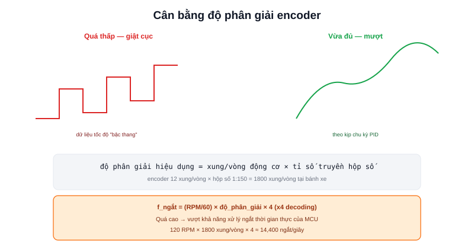

Bài [Encoder](/blog/encoder-cho-amr) đã giải thích nguyên lý quadrature encoder. Nối tiếp bài [Chọn Motor](/blog/chon-motor-cho-amr), câu hỏi bây giờ là: động cơ đã chọn xong (RPM đã biết) — cần encoder độ phân giải bao nhiêu để odometry đủ mượt mà không lãng phí tài nguyên xử lý ngắt trên MCU?



## Độ phân giải hiệu dụng: xung/vòng bánh xe, không phải xung/vòng động cơ

Nếu encoder gắn trước hộp số (trên trục động cơ, như đã bàn ở bài Encoder), độ phân giải hiệu dụng tại bánh xe được **nhân thêm tỉ số truyền hộp số**:

```text
độ_phân_giải_hiệu_dụng = xung_encoder_mỗi_vòng × tỉ_số_truyền_hộp_số
```

Ví dụ encoder 12 xung/vòng (khá thấp), hộp số tỉ số 1:150 — độ phân giải hiệu dụng tại bánh xe là `12 × 150 = 1800` xung/vòng, đủ mượt dù bản thân encoder có độ phân giải danh nghĩa thấp. Đây là lý do nhiều động cơ giảm tốc giá rẻ (gear motor) vẫn cho odometry đủ tốt dù encoder tích hợp có vẻ "yếu" trên giấy tờ.

## Tính tần số ngắt tối đa — giới hạn thực tế của MCU

Mỗi xung encoder thường kích hoạt một ngắt (interrupt) trên MCU để đếm — tần số ngắt quá cao có thể chiếm hết thời gian xử lý của MCU, ảnh hưởng tới các tác vụ thời gian thực khác (như vòng PID đã học ở bài [PID trong hệ thống điều khiển robot](/blog/pid-trong-he-thong-dieu-khien-robot)):

```text
f_ngắt = (RPM / 60) × độ_phân_giải_hiệu_dụng × 4
```

(nhân 4 vì quadrature encoder tạo 4 sự kiện cạnh lên/xuống trên mỗi chu kỳ xung — kỹ thuật "x4 decoding" phổ biến để tăng độ phân giải hiệu dụng mà không cần đĩa encoder mịn hơn)

Ví dụ với động cơ 120 RPM, độ phân giải hiệu dụng 1800 xung/vòng:

```text
f_ngắt = (120/60) × 1800 × 4 = 14,400 ngắt/giây
```

Con số này với hầu hết MCU hiện đại (STM32, ESP32) vẫn nằm trong khả năng xử lý — nhưng nếu chọn hộp số tỉ số truyền cao hơn nhiều (ví dụ 1:1000) mà không tính lại, tần số ngắt có thể vượt quá khả năng MCU xử lý kịp, gây mất xung đếm và odometry sai lệch.

> **Tóm lại:** Độ phân giải càng cao không phải lúc nào cũng tốt hơn — vượt quá một ngưỡng nhất định, tần số ngắt sinh ra vượt khả năng xử lý thời gian thực của MCU, phản tác dụng (mất xung, đếm sai) thay vì giúp odometry chính xác hơn. Cần cân bằng giữa độ phân giải và khả năng xử lý thực tế của MCU đang dùng.

## Chọn theo yêu cầu độ mượt tối thiểu

Ngược lại, độ phân giải quá thấp làm dữ liệu tốc độ tính từ encoder bị "giật cục" — đặc biệt rõ ở tốc độ thấp, khi khoảng thời gian giữa 2 xung liên tiếp trở nên đáng kể so với chu kỳ đọc:

```text
Δt_giữa_2_xung = 60 / (RPM_thấp_nhất × độ_phân_giải_hiệu_dụng)
```

Nếu `Δt_giữa_2_xung` lớn hơn đáng kể chu kỳ vòng lặp PID (ví dụ vòng PID chạy 100Hz = chu kỳ 10ms, nhưng 50ms mới có 1 xung mới), việc tính tốc độ tức thời từ encoder sẽ không cập nhật kịp trong nhiều chu kỳ liên tiếp — gây hiện tượng "bậc thang" trong dữ liệu tốc độ đo được, ảnh hưởng trực tiếp tới chất lượng điều khiển PID.

## Bảng tham khảo nhanh

| Độ phân giải hiệu dụng | Phù hợp |
|---|---|
| &lt; 500 xung/vòng | Chỉ đủ cho robot tốc độ cao, không cần odometry chính xác |
| 500-2000 xung/vòng | Phổ biến cho AMR cỡ nhỏ-vừa, cân bằng tốt | 
| &gt; 2000 xung/vòng | Cần thiết cho ứng dụng đòi hỏi định vị rất chính xác, MCU đủ mạnh xử lý |

Với đa số dự án AMR nghiên cứu/DIY cỡ như các dự án showcase ở trang này, khoảng 1000-2000 xung/vòng hiệu dụng (thường đạt được nhờ tỉ số truyền hộp số, không cần encoder độ phân giải cao đắt tiền) là điểm cân bằng hợp lý.
