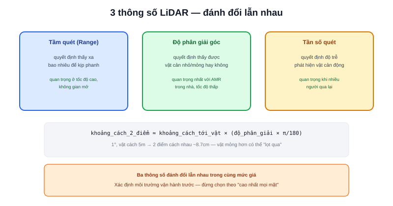

Bài [LiDAR trong kiến trúc AMR](/blog/lidar-trong-kien-truc-amr) đã bàn vị trí lắp đặt. Khi chọn mua LiDAR thực tế, ba thông số trên datasheet quyết định trực tiếp chất lượng SLAM/né vật cản: tầm quét, độ phân giải góc, và tần số quét.



## Tầm quét (Range) — đủ xa để phản ứng kịp, không cần xa hơn

Tầm quét tối thiểu cần thiết phụ thuộc tốc độ tối đa của robot và quãng đường phanh an toàn:

```text
range_tối_thiểu > v_max × t_phản_ứng + quãng_đường_phanh
```

Với robot tốc độ tối đa 0.5 m/s (khá điển hình cho AMR trong nhà), ngay cả LiDAR tầm ngắn ~8m (như YDLIDAR X3 Pro dùng trong dự án showcase) đã dư thừa nhiều lần so với mức cần thiết tối thiểu — tầm quét hiếm khi là yếu tố giới hạn thực sự với AMR tốc độ thấp trong nhà, nhưng trở nên quan trọng hơn nhiều với robot tốc độ cao hoặc không gian mở rộng (kho ngoài trời, nhà xưởng lớn).

## Độ phân giải góc — quyết định phát hiện được vật cản nhỏ ở xa hay không

Độ phân giải góc (thường tính bằng độ, ví dụ 0.5°/mẫu) quyết định khoảng cách giữa hai điểm đo liên tiếp ở một khoảng cách cho trước:

```text
khoảng_cách_giữa_2_điểm ≈ khoảng_cách_tới_vật × (độ_phân_giải_góc × π/180)
```

Ví dụ độ phân giải 1°, vật cản cách 5m: khoảng cách giữa 2 điểm đo liên tiếp ≈ `5 × (1 × π/180) ≈ 0.087m` (~8.7cm). Một vật cản mỏng hơn 8.7cm (chân ghế, cột nhỏ) ở khoảng cách này có thể **lọt qua giữa hai điểm đo**, không được phát hiện dù nằm trong tầm quét danh nghĩa của LiDAR.

> **Tóm lại:** Độ phân giải góc quan trọng hơn tầm quét tối đa với phần lớn AMR trong nhà — vật cản nhỏ, mỏng (chân bàn, cột) là nguy cơ va chạm thực tế hơn nhiều so với vật cản lớn ở xa. Khi ngân sách giới hạn, ưu tiên độ phân giải góc tốt hơn là tầm quét xa hơn mức cần thiết.

## Tần số quét (Scan Rate) — ảnh hưởng tới độ trễ phát hiện vật cản động

Tần số quét (Hz) quyết định bao lâu robot nhận được một bộ dữ liệu quét đầy đủ mới — quan trọng nhất khi né vật cản **động** (người đi bộ), vì độ trễ giữa hai lần quét là khoảng thời gian robot "mù" với chuyển động của vật cản đó:

```text
độ_trễ_tối_đa = 1 / tần_số_quét
quãng_đường_vật_cản_di_chuyển_trong_độ_trễ = v_vật_cản × độ_trễ_tối_đa
```

Với LiDAR quét 10Hz (độ trễ tối đa 100ms) và người đi bộ tốc độ ~1.4 m/s, vật cản có thể dịch chuyển tới 14cm giữa hai lần quét liên tiếp — vẫn đủ nhỏ để Nav2 phản ứng kịp trong hầu hết tình huống, nhưng là lý do LiDAR tần số quét quá thấp (dưới 5Hz) không phù hợp cho môi trường có nhiều người/vật thể di chuyển nhanh qua lại.

## Bảng tổng hợp ưu tiên theo môi trường vận hành

| Môi trường | Ưu tiên thông số | Lý do |
|---|---|---|
| Trong nhà, tốc độ thấp, nhiều vật cản nhỏ | Độ phân giải góc | Phát hiện chân bàn, cột nhỏ |
| Nhiều người/vật di chuyển qua lại | Tần số quét | Giảm độ trễ phát hiện vật cản động |
| Ngoài trời, không gian mở, tốc độ cao | Tầm quét | Cần thấy xa để có đủ thời gian phanh |

Ba thông số này thường đánh đổi lẫn nhau trong cùng một mức giá — LiDAR rẻ hơn thường phải hy sinh một trong ba để giữ hai cái còn lại ở mức chấp nhận được. Xác định rõ môi trường vận hành thực tế trước khi chọn, thay vì chọn theo thông số "cao nhất" trên mọi mặt (thường đắt không cần thiết).
