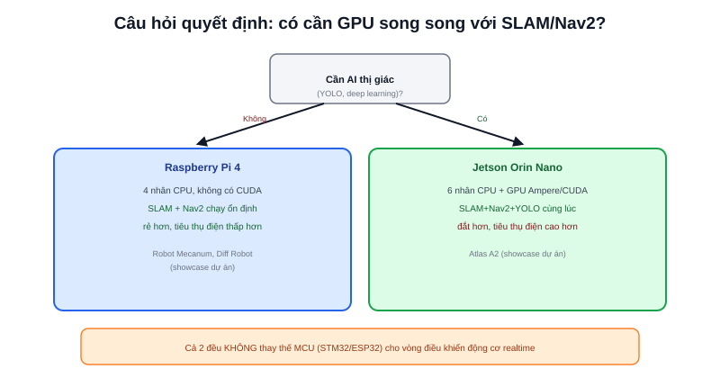

Bài [Kiến trúc phần cứng](/blog/kien-truc-phan-cung-robot-di-dong) đã nhắc SBC (Jetson, Raspberry Pi) là lựa chọn phổ biến cho "bộ não" AMR chạy ROS2. Câu hỏi thực tế khi thiết kế: chọn loại nào? Ba dự án showcase của trang này (xem [Robot Mecanum](/du-an/mecanum-robot), [Diff Robot](/du-an/diff-robot), [Atlas A2](/du-an/atlas-a2)) là ví dụ trực tiếp cho quyết định này.

## Raspberry Pi 4: đủ cho SLAM + Nav2 thuần tuý

Robot Mecanum và Diff Robot (showcase của trang này) đều dùng Raspberry Pi 4 chạy ROS2, xử lý SLAM (Cartographer/SLAM Toolbox) và Nav2 — hoàn toàn ổn định trên CPU thuần, không cần GPU. Đây là mức tải tính toán "chuẩn" của một AMR cơ bản: xử lý dữ liệu LiDAR (mảng 1D nhẹ), tính toán costmap, chạy thuật toán path planning — tất cả đều là các phép toán CPU truyền thống, không đòi hỏi xử lý song song hàng loạt như deep learning.

## Jetson Orin Nano: cần thiết khi thêm AI thị giác thời gian thực

Atlas A2 (showcase của trang này) nâng cấp lên Jetson Orin Nano — không phải "mạnh hơn cho chắc", mà vì dự án thêm **YOLOv8 object detection qua camera** chạy song song với SLAM/Nav2. Suy luận (inference) một mô hình deep learning theo thời gian thực đòi hỏi xử lý hàng triệu phép tính song song mỗi giây — đúng loại việc GPU (đặc biệt GPU CUDA như trên Jetson) làm nhanh hơn CPU hàng chục đến hàng trăm lần, trong khi Raspberry Pi 4 chỉ có CPU thuần, khó chạy mượt real-time nếu chạy song song với cả SLAM/Nav2.

> **Tóm lại:** Câu hỏi quyết định không phải "robot của tôi cần mạnh tới đâu" một cách chung chung, mà cụ thể hơn: **có tác vụ nào cần GPU (deep learning, xử lý ảnh nặng) chạy song song với SLAM/Nav2 hay không?** Có → cần SBC có GPU (Jetson). Không → Raspberry Pi 4 (hoặc tương đương) thường đã đủ, rẻ hơn đáng kể.

## Bảng so sánh dựa trên 2 lựa chọn thực tế đã dùng

| Tiêu chí | Raspberry Pi 4 | Jetson Orin Nano |
|---|---|---|
| CPU | 4 nhân ARM Cortex-A72 | 6 nhân ARM Cortex-A78AE |
| GPU | Không có GPU tính toán chung (CUDA) | GPU Ampere, hỗ trợ CUDA |
| Phù hợp | SLAM + Nav2 thuần tuý | SLAM + Nav2 + YOLO/AI thị giác cùng lúc |
| Giá tham khảo | Thấp hơn nhiều | Cao hơn đáng kể |
| Tiêu thụ điện | Thấp | Cao hơn — ảnh hưởng tới tính toán pin (bài tiếp theo) |

## MCU riêng vẫn cần dù chọn SBC nào

Dù chọn Raspberry Pi 4 hay Jetson, cả hai đều **không thay thế được MCU** (STM32/ESP32) cho vòng điều khiển động cơ thời gian thực (đã nói ở bài [PID trong hệ thống điều khiển robot](/blog/pid-trong-he-thong-dieu-khien-robot)) — SBC chạy Linux không phải hệ điều hành thời gian thực (real-time OS), độ trễ không xác định (non-deterministic) theo kiểu MCU. Kiến trúc chuẩn luôn là SBC (SLAM/Nav2/AI) + MCU (điều khiển động cơ realtime) phối hợp, không phải chọn một trong hai.

## Không chỉ 2 lựa chọn này

Raspberry Pi 4 và Jetson Orin Nano chỉ là hai điểm dữ liệu cụ thể từ các dự án showcase — hệ sinh thái SBC còn nhiều lựa chọn khác (Jetson Nano cũ hơn/rẻ hơn, Jetson Orin NX mạnh hơn, các board Rockchip có NPU riêng...) với đánh đổi tương tự: càng nhiều khả năng xử lý AI song song, giá và tiêu thụ điện càng tăng. Nguyên tắc chọn vẫn không đổi — xác định rõ tác vụ tính toán thực tế cần chạy trước, rồi mới chọn phần cứng đủ đáp ứng, thay vì chọn dư thừa "cho chắc".
