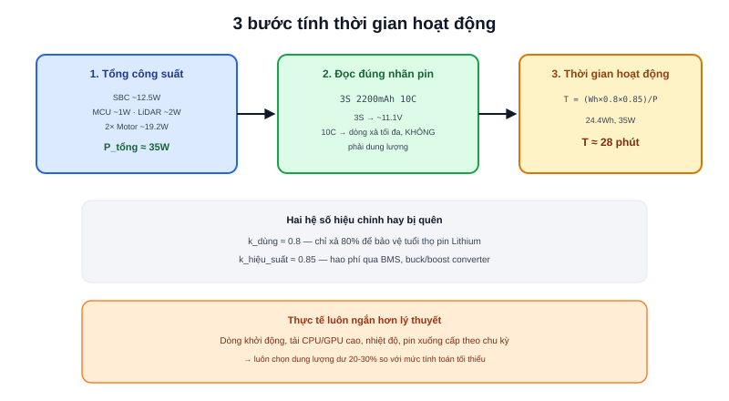

Sau khi đã chọn Motor, Encoder, LiDAR, và Computer ở các bài trước, mỗi linh kiện đó đều tiêu thụ một dòng điện cụ thể. Bài này tổng hợp lại thành một con số duy nhất: robot chạy được bao lâu trước khi cần sạc.



## Bước 1: Cộng dồn công suất tiêu thụ từng khối

```text
P_tổng = P_computer + P_sensor + P_motor
```

Ví dụ một AMR tầm trung (tham khảo cấu hình gần với dự án Diff Robot ở phần showcase):

| Thành phần | Công suất |
|---|---|
| SBC (Raspberry Pi 4, tải cao) | ~12.5W (2.5A @ 5V) |
| MCU điều khiển | ~1W |
| LiDAR | ~2W |
| 2× Motor DC (tải trung bình) | ~19.2W (2× 0.8A @ 12V) |
| **Tổng** | **~35W** |

## Bước 2: Dung lượng pin — đọc đúng ký hiệu trên nhãn

Pin Lithium (LiPo/Li-ion) thường ghi theo dạng `<số cell>S<dung lượng>` và hệ số xả `<số>C`:

```text
3S 2200mAh 10C  nghĩa là:
  3S → 3 cell nối tiếp, điện áp danh nghĩa 3×3.7V ≈ 11.1V
  2200mAh → dung lượng
  10C → dòng xả liên tục tối đa = 10 × 2.2A = 22A
```

> **Tóm lại:** Hệ số `C` không phải dung lượng — nó là **giới hạn dòng xả**, thường dư dả rất nhiều so với dòng tải thực tế của AMR cỡ nhỏ (vài Ampe). Với robot dùng pin công suất lớn hơn (như 2× pin 12VDC 40Ah trong dự án Atlas A2), việc kiểm tra dòng xả gần như luôn thừa biên độ — dung lượng và thời gian hoạt động mới là yếu tố giới hạn thực sự, không phải khả năng xả dòng.

## Bước 3: Thời gian hoạt động ước lượng

```text
Năng_lượng_pin (Wh) = Điện_áp × Dung_lượng (Ah)
T_hoạt_động = (Năng_lượng_pin × k_dùng × k_hiệu_suất) / P_tổng
```

Hai hệ số hiệu chỉnh quan trọng, hay bị bỏ quên khi tính nhanh:

```text
k_dùng ≈ 0.8   — chỉ nên xả 80% dung lượng để bảo vệ tuổi thọ pin Lithium
                 (xả cạn kiệt liên tục làm pin chai nhanh hơn nhiều)
k_hiệu_suất ≈ 0.85 — hao phí qua các module chuyển đổi nguồn (BMS, buck/boost)
```

Ví dụ pin 3S 2200mAh (~11.1V, ~24.4Wh), robot tiêu thụ 35W trung bình:

```text
T = (24.4 × 0.8 × 0.85) / 35 ≈ 0.47 giờ (~28 phút)
```

## Vì sao thời gian thực tế luôn ngắn hơn tính toán lý thuyết

Con số tính được ở trên là mức trung bình lý tưởng — thực tế thường ngắn hơn vì:

```text
- Dòng khởi động động cơ cao hơn nhiều so với dòng trung bình (đã nói ở bài Chọn Motor)
- CPU/GPU tải cao hơn khi chạy nhiều tác vụ cùng lúc (SLAM + Nav2 + AI thị giác)
- Nhiệt độ môi trường ảnh hưởng tới hiệu suất pin thực tế
- Pin xuống cấp theo số chu kỳ sạc/xả đã qua
```

Nguyên tắc thực tế: luôn tính dư ít nhất 20-30% so với con số lý thuyết khi ước lượng thời gian vận hành thực sự cần đảm bảo, hoặc tương đương, chọn dung lượng pin lớn hơn 20-30% so với mức tính toán tối thiểu.

## Bảng quy trình tổng hợp

| Bước | Việc cần làm | Công thức |
|---|---|---|
| 1 | Cộng công suất từng khối đã chọn | `P_tổng = ΣP_i` |
| 2 | Đọc đúng thông số pin | Điện áp, dung lượng (Ah), hệ số C |
| 3 | Tính thời gian hoạt động | `T = (V×Ah × 0.8 × 0.85) / P_tổng` |
| 4 | Thêm biên độ an toàn | Nhân thêm 1.2-1.3 lần dung lượng tính được |

Bài cuối cùng của chuyên mục, [Tính tải](/blog/tinh-tai-cho-amr), sẽ khép lại vòng thiết kế bằng việc kiểm tra toàn bộ hệ thống (motor, khung, pin) có thực sự chịu được khối lượng hàng hoá dự kiến chở hay không.
