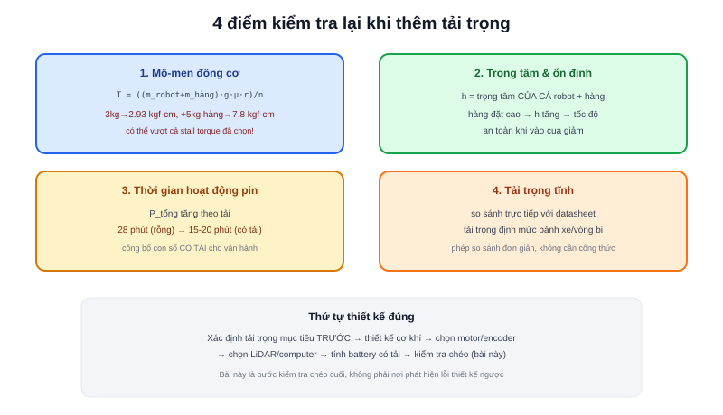

Các bài trước — [Chọn Motor](/blog/chon-motor-cho-amr), [Thiết kế cơ khí](/blog/thiet-ke-co-khi-cho-amr), [Tính Battery](/blog/tinh-battery-cho-amr) — đều giả định một khối lượng robot cụ thể. Nhưng mục đích tồn tại của AMR là **chở hàng** — khối lượng thực tế khi vận hành luôn lớn hơn robot rỗng. Bài này khép lại chuyên mục bằng việc quay lại kiểm tra từng phép tính trước đó với tải trọng đầy đủ.



## Điểm kiểm tra 1: Mô-men động cơ còn đủ không

Công thức từ bài [Chọn Motor](/blog/chon-motor-cho-amr) dùng trực tiếp khối lượng `m` — thêm tải trọng nghĩa là `m` tăng, `T_yêu_cầu` tăng theo tỉ lệ thuận:

```text
T_yêu_cầu(có tải) = ((m_robot + m_hàng) × g × μ × r) / n
```

Ví dụ robot rỗng 3kg (đã tính ở bài Chọn Motor, `T ≈ 2.93 kgf·cm`), thêm 5kg hàng hoá:

```text
T_yêu_cầu(có tải) = ((3+5) × 9.8 × 0.6 × 0.0325) / 2 ≈ 0.765 N·m ≈ 7.8 kgf·cm
```

So với động cơ đã chọn (stall torque 7.3 kgf·cm ở ví dụ bài trước) — **không còn đủ biên độ an toàn**, thậm chí vượt cả stall torque danh nghĩa. Đây chính xác là loại sai sót phổ biến nhất khi thiết kế AMR: tính mô-men trên robot rỗng, quên kiểm tra lại khi robot chở tải thực tế.

> **Tóm lại:** Tải trọng thiết kế (design payload) phải được xác định **trước khi** chọn motor ở bài trước, không phải sau. Nếu quy trình thiết kế đi đúng thứ tự (xác định tải trọng mục tiêu → tính mô-men cần thiết bao gồm cả tải → chọn động cơ đủ biên độ), tình huống "không đủ mô-men" ở trên sẽ không xảy ra — bài này tồn tại như một bước kiểm tra chéo, không phải để phát hiện lỗi thiết kế ngược quy trình.

## Điểm kiểm tra 2: Trọng tâm có dịch chuyển nguy hiểm không

Bài [Thiết kế cơ khí](/blog/thiet-ke-co-khi-cho-amr) đã nói trọng tâm càng thấp càng ổn định — nhưng đó là trọng tâm của **robot + hàng hoá** cộng lại, không phải trọng tâm robot rỗng. Hàng hoá đặt cao (ví dụ trên một AMR conveyor-top chở thùng hàng cao, theo phân loại ở bài [Các loại AMR](/blog/cac-loai-amr)) kéo trọng tâm tổng thể lên cao hơn đáng kể so với tính toán ban đầu — cần tính lại tốc độ an toàn khi vào cua theo đúng công thức đã nêu ở bài Thiết kế cơ khí, với `h` mới đã tính cả ảnh hưởng của hàng hoá.

## Điểm kiểm tra 3: Battery có đủ dòng và đủ lâu không

Tải nặng hơn → động cơ cần dòng điện lớn hơn để duy trì cùng tốc độ → công suất tiêu thụ `P_tổng` (bài [Tính Battery](/blog/tinh-battery-cho-amr)) tăng → thời gian hoạt động giảm:

```text
P_motor(có tải) tăng theo mô-men yêu cầu tăng
T_hoạt_động(có tải) = (Năng_lượng_pin × k_dùng × k_hiệu_suất) / P_tổng(có tải)
```

Robot chạy được 28 phút khi rỗng (ví dụ bài trước) có thể chỉ còn 15-20 phút khi chở đủ tải thiết kế — con số cần công bố cho người vận hành thực tế là thời gian hoạt động **có tải**, không phải con số đẹp hơn khi tính trên robot rỗng.

## Điểm kiểm tra 4: Khung và bánh xe có chịu được tải tĩnh không

Khác ba điểm trên (đều liên quan chuyển động), đây là kiểm tra tải **tĩnh** đơn giản: tổng khối lượng (robot + hàng) có vượt quá tải trọng định mức của bánh xe, vòng bi, hoặc khung cơ khí đã chọn hay không — thông số này luôn có sẵn trên datasheet bánh xe/vòng bi, chỉ cần cộng tổng và so sánh trực tiếp, không cần tính toán phức tạp.

## Bảng tổng hợp — khép lại toàn bộ chuyên mục Thiết kế AMR thực tế

| Điểm kiểm tra | Ảnh hưởng khi thêm tải | Bài liên quan |
|---|---|---|
| Mô-men động cơ | Tăng tuyến tính theo khối lượng | Chọn Motor |
| Trọng tâm & ổn định | Có thể tăng nếu hàng đặt cao | Thiết kế cơ khí |
| Thời gian hoạt động pin | Giảm do dòng tiêu thụ tăng | Tính Battery |
| Tải trọng tĩnh khung/bánh | So sánh trực tiếp với datasheet | (mới, bài này) |

Quy trình thiết kế AMR hoàn chỉnh, đi đúng thứ tự các bài trong chuyên mục này: xác định tải trọng mục tiêu trước tiên → thiết kế cơ khí quanh tải trọng đó → chọn motor/encoder đủ biên độ cho tải đó → chọn LiDAR/computer theo môi trường vận hành → tính battery theo đúng công suất tiêu thụ có tải → cuối cùng, kiểm tra chéo lại tất cả bằng chính bài này trước khi bắt tay vào chế tạo phần cứng thật.
