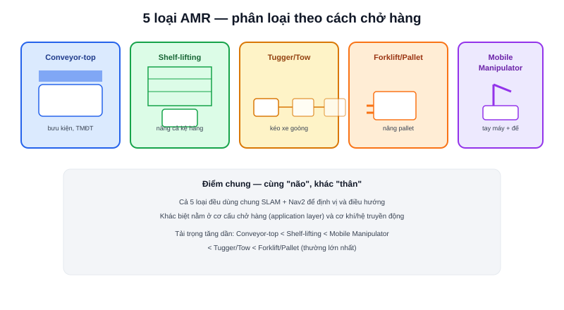

Bài [AMR và AGV: Khác nhau ở đâu](/blog/amr-vs-agv-khac-nhau-o-dau) đã phân biệt AMR với AGV ở cách **dẫn đường**. Nhưng bản thân AMR cũng không phải một hình dạng cố định — tuỳ vào **cách chở hàng**, AMR chia thành nhiều loại rất khác nhau về thiết kế cơ khí, dù đều dùng chung nền tảng SLAM/Nav2 bên dưới.

## Conveyor-top AMR — băng chuyền gắn trên lưng

Robot mang một đoạn băng chuyền nhỏ trên lưng — hàng hoá được băng chuyền tại trạm nạp đẩy thẳng lên robot, robot di chuyển tới trạm đích rồi tự đẩy hàng xuống bằng chính băng chuyền đó. Không cần cơ cấu nâng hạ phức tạp, tốc độ trao đổi hàng nhanh — phổ biến trong phân loại bưu kiện, kho thương mại điện tử.

## Shelf-lifting AMR — nâng cả kệ hàng

Robot chui xuống gầm một kệ hàng di động, nâng cả kệ lên khỏi mặt sàn vài cm, rồi di chuyển nguyên kệ đó tới trạm lấy hàng — thay vì robot tự lấy từng món hàng, **hàng hoá được mang đến người lấy hàng**. Đây chính là mô hình nổi tiếng của Kiva Systems (nay là Amazon Robotics) — thay đổi hoàn toàn cách bố trí kho hàng thương mại điện tử quy mô lớn.

## Tugger/Tow AMR — kéo xe goòng

Robot không chở hàng trực tiếp, mà **móc nối và kéo theo** một hoặc nhiều xe goòng (cart) chở hàng phía sau — giống một đầu tàu kéo toa. Phù hợp vận chuyển khối lượng lớn giữa các trạm cố định trong nhà máy (ví dụ linh kiện ô tô), tận dụng lại được hạ tầng xe đẩy sẵn có mà không cần thiết kế lại.

## Forklift/Pallet AMR — nâng pallet như xe nâng

Mô phỏng chức năng xe nâng tay/xe nâng điện truyền thống nhưng tự hành hoàn toàn — có càng nâng (fork) để luồn vào pallet gỗ tiêu chuẩn, nâng lên và di chuyển. Đòi hỏi độ chính xác định vị cao nhất trong các loại AMR (phải luồn càng đúng khe pallet, sai vài cm là thất bại) và tải trọng lớn nhất, thường vài trăm kg đến hàng tấn.

## Mobile Manipulator — AMR gắn tay máy

Một tay máy robot (robotic arm) gắn trực tiếp lên đế AMR di động — kết hợp khả năng "tự đi tới nơi" với khả năng "tự thao tác vật thể" (nhặt, đặt, lắp ráp). Đây là loại phức tạp nhất: bài toán động học không chỉ có động học di chuyển của đế AMR (đã học ở bài [Forward Kinematics](/blog/forward-kinematics)) mà còn thêm động học của tay máy, phối hợp cả hai để tay máy thao tác chính xác trong khi đế đang hoặc vừa mới di chuyển.

## Bảng so sánh nhanh

| Loại | Cách chở hàng | Tải trọng điển hình | Ứng dụng chính |
|---|---|---|---|
| Conveyor-top | Băng chuyền trên lưng | Nhẹ (bưu kiện, thùng carton) | Phân loại bưu kiện, kho TMĐT |
| Shelf-lifting | Nâng cả kệ hàng | Trung bình | Kho hàng TMĐT quy mô lớn |
| Tugger/Tow | Kéo xe goòng phía sau | Lớn (nhiều xe cùng lúc) | Nhà máy sản xuất, logistics nội bộ |
| Forklift/Pallet | Càng nâng như xe nâng | Rất lớn (pallet chuẩn) | Kho bãi, cảng, trung tâm phân phối |
| Mobile Manipulator | Tay máy gắn trên đế | Nhỏ, cần thao tác chính xác | Lắp ráp linh hoạt, kiểm tra chất lượng |

## Điểm chung: phần "não" giống nhau, phần "thân" khác nhau

Dù hình dạng cơ khí khác biệt hoàn toàn, cả năm loại đều dùng chung một kiến trúc phần mềm nền tảng — SLAM để định vị, Nav2 để điều hướng (đã nói ở bài [Bức tranh toàn cảnh phần mềm robot](/blog/buc-tranh-toan-canh-phan-mem-robot-ros2-slam-nav2)). Sự khác biệt chủ yếu nằm ở lớp ứng dụng (application layer) trên cùng — logic điều khiển băng chuyền, cơ cấu nâng, hay tay máy — và phần cơ khí/hệ truyền động bên dưới, sẽ được bàn kỹ ở chuyên mục [AMR Drive System](/blog/chon-he-truyen-dong-cho-amr) và [Thiết kế AMR thực tế](/blog/thiet-ke-co-khi-cho-amr).
