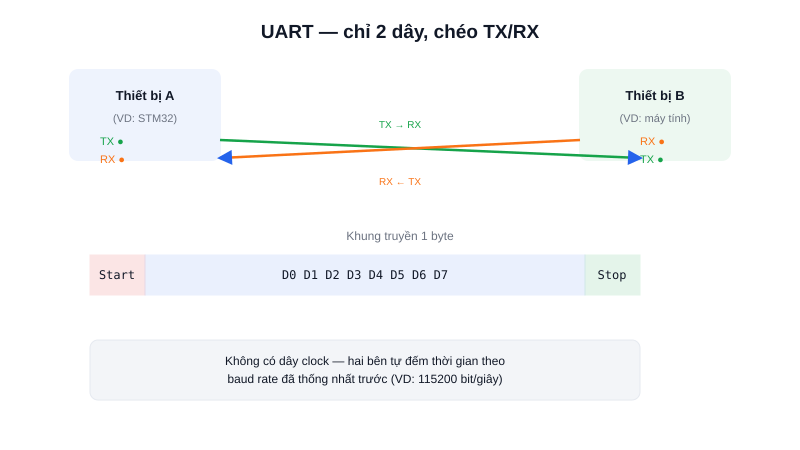

Khi cần hai thiết bị "nói chuyện" với nhau — MCU với máy tính, MCU với module GPS, hay hai board điều khiển trong cùng một robot — **UART** thường là lựa chọn đầu tiên vì nó đơn giản nhất: chỉ cần 2 dây, không cần cấu hình phức tạp, và gần như mọi vi điều khiển đều có sẵn ít nhất một cổng UART.



## Khái niệm chính

UART (Universal Asynchronous Receiver/Transmitter) truyền dữ liệu **nối tiếp** (từng bit một, trên một dây) thay vì song song (nhiều bit cùng lúc, nhiều dây) — đánh đổi tốc độ để lấy sự đơn giản: chỉ cần dây **TX** (Transmit) và **RX** (Receive), không cần thêm dây tín hiệu nào khác. Chữ "Asynchronous" (bất đồng bộ) nghĩa là **không có dây clock riêng** — hai bên phải thống nhất trước tốc độ truyền (**baud rate**, ví dụ 9600 hay 115200 bit/giây) để tự đếm thời gian đúng lúc lấy mẫu từng bit.

Mỗi byte dữ liệu được đóng gói trong một khung gồm: 1 bit start (báo bắt đầu), 8 bit dữ liệu, tùy chọn 1 bit kiểm tra chẵn lẻ (parity), và 1 bit stop (báo kết thúc).

### Kết nối UART luôn phải "chéo dây"

Chân TX của thiết bị A phải nối vào chân RX của thiết bị B, và ngược lại — nối TX với TX (nhầm lẫn rất phổ biến ở người mới) khiến cả hai bên cùng "nói" mà không ai "nghe".

> **Tóm lại:** UART đơn giản, rẻ, có sẵn khắp nơi — nhưng chỉ giao tiếp được **1-đối-1** giữa hai thiết bị; cần nhiều thiết bị cùng chia sẻ một bus thì phải dùng I2C hoặc SPI.

## Nguyên lý hoạt động

```text
Đường truyền ở mức nghỉ (idle) = mức cao (1)

  ___     ___ ___ ___ ___ ___ ___ ___ ___     _______
 |   |   |                               |   |
 |___|___|_D0_D1_D2_D3_D4_D5_D6_D7_______|___|
  Start          8 bit dữ liệu (LSB trước)  Stop
```

Cấu hình UART bằng Arduino chỉ cần một dòng, chỉ định đúng baud rate hai bên đã thống nhất:

```cpp
void setup() {
  Serial.begin(115200);   // Phải khớp baud rate với thiết bị bên kia
}

void loop() {
  if (Serial.available()) {
    char c = Serial.read();  // Đọc 1 byte vừa nhận được qua RX
    Serial.write(c);         // Gửi lại qua TX
  }
}
```

Vì không có dây clock chung, nếu hai bên lệch baud rate dù chỉ vài phần trăm, việc lấy mẫu bit sẽ dần trôi lệch theo thời gian — đây là lý do nhận được **ký tự rác** khi cấu hình sai baud rate là lỗi UART phổ biến nhất. Trong một AMR, UART thường được dùng để nối STM32 (tầng điều khiển) với module GPS/GPS RTK, hoặc làm kênh giao tiếp đơn giản giữa hai board khi không cần tốc độ cao hay nhiều thiết bị trên cùng bus.
