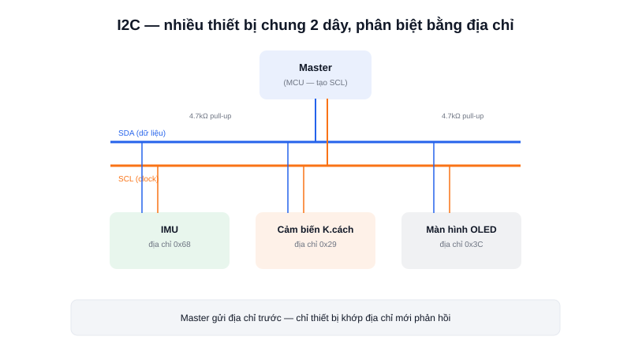

UART chỉ nói chuyện được giữa đúng hai thiết bị. Nhưng một robot thực tế thường có rất nhiều cảm biến — IMU, cảm biến khoảng cách, màn hình OLED — và MCU chỉ có giới hạn số chân GPIO. **I2C** giải quyết đúng bài toán này: nhiều thiết bị cùng chia sẻ chung một bus 2 dây, phân biệt nhau bằng địa chỉ.



## Khái niệm chính

I2C (Inter-Integrated Circuit) dùng đúng 2 dây tín hiệu cho **toàn bộ bus**, bất kể có bao nhiêu thiết bị kết nối:
- **SDA (Serial Data)** — dây dữ liệu, dùng chung cho cả gửi và nhận
- **SCL (Serial Clock)** — dây xung nhịp, do thiết bị **master** (thường là MCU) tạo ra

Khác với UART (bất đồng bộ, không có clock), I2C là giao tiếp **đồng bộ** — có dây clock riêng, nên hai bên không cần thống nhất tốc độ trước, tránh được lỗi trôi baud rate.

### Địa chỉ — chìa khoá để nhiều thiết bị dùng chung 2 dây

Mỗi thiết bị trên bus I2C có một **địa chỉ 7-bit** cố định (một số chip cho phép đổi vài bit thấp bằng chân phần cứng để tránh trùng địa chỉ). Khi MCU (master) muốn nói chuyện với một cảm biến cụ thể, nó gửi đúng địa chỉ đó lên bus trước — chỉ thiết bị có địa chỉ khớp mới "trả lời" (ACK), các thiết bị khác im lặng bỏ qua.

> **Tóm lại:** I2C đánh đổi tốc độ (chậm hơn SPI) để lấy khả năng ghép nhiều thiết bị trên cùng 2 dây — lý tưởng khi cần đọc nhiều cảm biến giá rẻ mà không muốn tốn nhiều chân GPIO.

## Nguyên lý hoạt động

```text
Master (MCU)
   SDA ──┬─────────┬─────────┬───── (cần điện trở pull-up)
   SCL ──┼─────────┼─────────┼───── (cần điện trở pull-up)
         │         │         │
     Cảm biến   Cảm biến   Màn hình
     IMU        khoảng     OLED
     (0x68)     cách       (0x3C)
                (0x29)
```

Một giao dịch I2C điển hình: master phát **điều kiện START**, gửi địa chỉ 7-bit + 1 bit đọc/ghi, thiết bị khớp địa chỉ phản hồi **ACK**, sau đó dữ liệu được truyền từng byte (mỗi byte cũng có ACK riêng), kết thúc bằng **điều kiện STOP**.

Ví dụ đọc dữ liệu từ một IMU bằng HAL trên STM32:

```c
uint8_t data[6];
HAL_I2C_Mem_Read(&hi2c1, IMU_ADDR << 1, REG_ACCEL_X, 1, data, 6, HAL_MAX_DELAY);
```

Vì SDA/SCL là **open-drain** (thiết bị chỉ có thể kéo dây xuống mức thấp, không tự đẩy lên cao), bus I2C luôn cần **điện trở pull-up** bên ngoài (thường 4.7kΩ) để dây trở lại mức cao khi không thiết bị nào đang giữ nó thấp — thiếu điện trở pull-up là nguyên nhân phổ biến nhất khiến I2C "không chạy" dù code hoàn toàn đúng.
