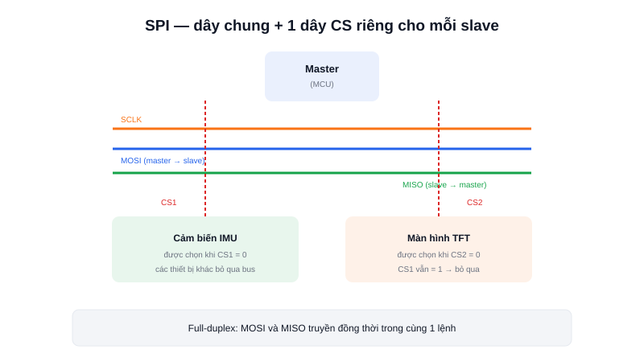

Khi I2C không đủ nhanh — ví dụ cần đọc liên tục dữ liệu từ một cảm biến IMU ở tần số cao, hay đẩy hình ảnh lên màn hình TFT — **SPI** là lựa chọn tiếp theo: nhanh hơn I2C và UART đáng kể, đánh đổi bằng việc cần nhiều dây hơn.



## Khái niệm chính

SPI (Serial Peripheral Interface) dùng 4 dây tín hiệu:
- **SCLK** (Serial Clock) — xung nhịp, do master tạo ra
- **MOSI** (Master Out, Slave In) — dữ liệu từ master gửi tới slave
- **MISO** (Master In, Slave Out) — dữ liệu từ slave gửi ngược về master
- **CS/SS** (Chip Select / Slave Select) — chọn thiết bị nào đang được nói chuyện

Vì có 2 dây dữ liệu riêng biệt cho hai chiều (MOSI và MISO), SPI truyền và nhận đồng thời — **full-duplex** — trong khi I2C và UART thường chỉ truyền một chiều tại một thời điểm.

### Không có địa chỉ — chọn thiết bị bằng dây CS riêng

Khác với I2C dùng địa chỉ để phân biệt thiết bị trên chung 2 dây, SPI không có khái niệm địa chỉ: mỗi slave có **một dây CS riêng** nối thẳng tới master. Muốn nói chuyện với thiết bị nào, master kéo đúng dây CS của thiết bị đó xuống mức thấp trước khi truyền — các thiết bị khác (CS đang ở mức cao) sẽ bỏ qua toàn bộ dữ liệu trên bus.

> **Tóm lại:** SPI nhanh hơn I2C nhiều lần nhờ full-duplex và không cần cơ chế địa chỉ/ACK phức tạp — đổi lại, càng nhiều thiết bị thì càng cần nhiều chân CS, không tiết kiệm chân GPIO như I2C.

## Nguyên lý hoạt động

```text
Master (MCU)
   SCLK ──┬─────────┬─────── (chung cho mọi slave)
   MOSI ──┼─────────┼─────── (chung cho mọi slave)
   MISO ──┼─────────┼─────── (chung cho mọi slave)
   CS1  ──┘         │
   CS2  ────────────┘
         │                  │
     Cảm biến IMU      Màn hình TFT
     (chọn khi CS1=0)  (chọn khi CS2=0)
```

Ví dụ đọc/ghi một byte bằng HAL trên STM32 — SPI luôn truyền và nhận đồng thời trong cùng một lệnh:

```c
HAL_GPIO_WritePin(CS1_GPIO_Port, CS1_Pin, GPIO_PIN_RESET); // Kéo CS1 xuống thấp, chọn thiết bị

uint8_t tx_data = 0x8F;   // Byte muốn gửi
uint8_t rx_data;          // Nơi lưu byte nhận về cùng lúc
HAL_SPI_TransmitReceive(&hspi1, &tx_data, &rx_data, 1, HAL_MAX_DELAY);

HAL_GPIO_WritePin(CS1_GPIO_Port, CS1_Pin, GPIO_PIN_SET);   // Nhả CS1, kết thúc giao dịch
```

SPI thường xuất hiện khi cần băng thông cao: đọc cảm biến IMU ở tần số vài trăm Hz đến vài kHz cho vòng điều khiển ổn định robot, đọc/ghi thẻ nhớ SD để log dữ liệu, hoặc điều khiển màn hình TFT cần đẩy hàng chục nghìn pixel mỗi khung hình — những việc mà tốc độ chậm hơn của I2C sẽ trở thành nút thắt cổ chai.
