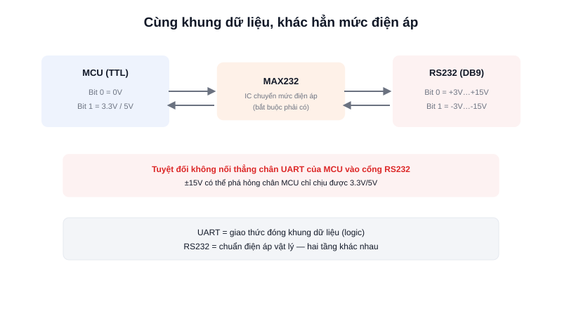

Rất nhiều thiết bị công nghiệp cũ (PLC, máy CNC, một số cảm biến đời cũ) vẫn dùng cổng **RS232** (hay được gọi là "cổng COM"), và người mới thường lẫn lộn RS232 với UART vì cả hai đều "truyền nối tiếp". Thực tế, đây là hai khái niệm ở hai tầng khác nhau: UART là **cách đóng khung dữ liệu (giao thức logic)**, còn RS232 là **chuẩn điện áp vật lý** — và sự khác biệt điện áp này là thứ khiến chúng không thể nối trực tiếp với nhau.



## Khái niệm chính

Chân UART trên một MCU hoạt động ở mức điện áp logic **TTL** — 0V cho bit 0, 3.3V hoặc 5V cho bit 1. RS232 dùng một **dải điện áp hoàn toàn khác**: khoảng **+3V đến +15V** cho bit 0, và **-3V đến -15V** cho bit 1 — thậm chí đảo cực tính so với logic thông thường.

Vì vậy, dù cùng dùng cùng một kiểu khung dữ liệu (start bit, 8 bit data, stop bit) như UART, **không thể nối trực tiếp chân UART của MCU vào cổng RS232** — cần một **IC chuyển mức điện áp** (kinh điển nhất là MAX232) đặt ở giữa để chuyển đổi qua lại.

### Vì sao vẫn còn tồn tại

Điện áp cao hơn (lên tới ±15V) giúp RS232 chống nhiễu tốt hơn TTL thông thường trên khoảng cách vài mét đến vài chục mét — đủ lý do để nhiều thiết bị công nghiệp lâu đời vẫn giữ nguyên chuẩn này thay vì thay thế, dù công nghệ mới hơn (USB, Ethernet) đã phổ biến từ lâu.

> **Tóm lại:** RS232 = UART (cùng cách đóng khung dữ liệu) + điện áp cao hơn, đảo cực (chuẩn điện áp khác hẳn TTL) — luôn cần IC chuyển mức khi kết nối MCU với thiết bị RS232, tuyệt đối không nối thẳng dây.

## Nguyên lý hoạt động

```text
MCU (TTL, 0V/3.3V)          MAX232 (chuyển mức)        Thiết bị RS232 (±V)
   TX ────────────────────►  chuyển 3.3V → ±15V  ────────► RX (DB9)
   RX ◄────────────────────  chuyển ±15V → 3.3V  ◄──────── TX (DB9)
```

Trong thực tế robot công nghiệp, RS232 hay gặp khi tích hợp với PLC đời cũ hoặc thiết bị đo lường chuyên dụng đã tồn tại từ trước — không phải lựa chọn cho thiết kế mới, nhưng cần biết để "nói chuyện" được với phần cứng sẵn có. Với kết nối mới hoàn toàn, hầu hết thiết kế hiện đại chọn UART mức TTL trực tiếp (khi khoảng cách ngắn) hoặc RS485 (khi cần khoảng cách xa và chống nhiễu tốt hơn) thay vì RS232.
