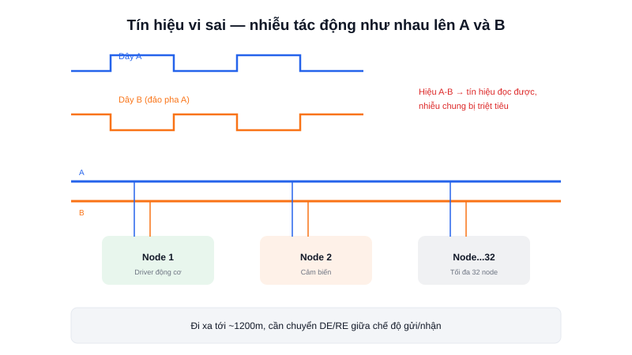

UART và RS232 đều có một điểm yếu chung: tín hiệu được so sánh với **mass (GND)** — nếu dây dài hoặc môi trường nhiều nhiễu điện (như gần động cơ công suất lớn trong nhà xưởng), tín hiệu dễ bị méo hoặc mất hoàn toàn. **RS485** giải quyết vấn đề này bằng một cách tiếp cận khác hẳn: tín hiệu **vi sai (differential)**.



## Khái niệm chính

Thay vì so sánh điện áp một dây với GND (như UART/RS232), RS485 dùng **2 dây A và B**, truyền cùng một tín hiệu nhưng **đảo pha nhau**. Bên nhận không đọc điện áp tuyệt đối của từng dây, mà đọc **hiệu điện áp giữa A và B**. Nếu có nhiễu điện tác động vào đường dây, nhiễu đó ảnh hưởng gần như như nhau lên cả A lẫn B — hiệu số A-B gần như không đổi, tín hiệu vẫn đọc đúng.

Nhờ cơ chế này, RS485 đạt được hai ưu điểm vượt trội so với RS232/UART thường:
- **Chống nhiễu tốt hơn nhiều**, phù hợp môi trường công nghiệp gần động cơ, biến tần
- **Khoảng cách xa hơn hẳn** — lên tới khoảng 1200m (so với vài mét của UART TTL thông thường)

### Bus nhiều node, nhưng phải kiểm soát chiều truyền

RS485 hỗ trợ tới 32 thiết bị trên cùng một cặp dây A/B (bus dạng multi-drop, tương tự ý tưởng của I2C nhưng ở tầng vật lý khác). Vì hầu hết mạch RS485 hoạt động **half-duplex** (không thể gửi và nhận đồng thời trên cùng cặp dây), IC chuyển đổi (ví dụ MAX485) có thêm chân **DE/RE** để chủ động chuyển giữa chế độ gửi (Driver Enable) và chế độ nhận (Receiver Enable) — quên chuyển đúng lúc là lỗi lập trình RS485 phổ biến nhất.

> **Tóm lại:** RS485 = tín hiệu vi sai (chống nhiễu, đi xa) + bus nhiều node (multi-drop) — đổi lại phải tự quản lý chiều truyền (DE/RE) và cần giao thức ở tầng trên (như Modbus RTU) để biết node nào đang được phép "nói".

## Nguyên lý hoạt động

```text
   A ──┬──────┬──────┬──────  (điện áp trên A tăng khi B giảm, và ngược lại)
   B ──┼──────┼──────┼──────
       │      │      │
    Node 1  Node 2  Node 3   (tối đa 32 node trên cùng bus)
```

Điều khiển chiều truyền bằng chân DE/RE trước khi gửi dữ liệu:

```c
HAL_GPIO_WritePin(DE_RE_Port, DE_RE_Pin, GPIO_PIN_SET);   // Chuyển sang chế độ GỬI
HAL_UART_Transmit(&huart1, data, len, HAL_MAX_DELAY);
HAL_GPIO_WritePin(DE_RE_Port, DE_RE_Pin, GPIO_PIN_RESET); // Chuyển lại chế độ NHẬN ngay khi gửi xong
```

Vì độ tin cậy cao trên khoảng cách xa, RS485 là lớp vật lý tiêu chuẩn cho rất nhiều driver động cơ công nghiệp, cảm biến công nghiệp, và đặc biệt là nền tảng vật lý cho giao thức **Modbus RTU** — thứ được dùng rất phổ biến để một bộ điều khiển trung tâm giao tiếp với nhiều driver động cơ hoặc cảm biến trải dài trên một AMR/AGV cỡ lớn.
