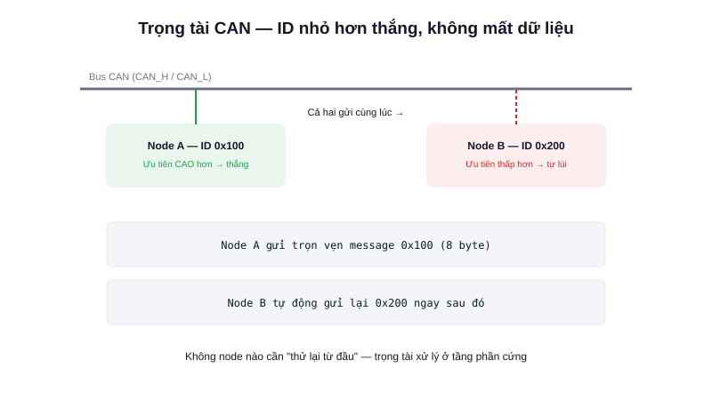

Trong một chiếc ô tô hiện đại có hàng chục bộ điều khiển điện tử (ECU) cùng chia sẻ thông tin — tốc độ bánh xe, nhiệt độ động cơ, trạng thái phanh — tất cả phải truyền cực kỳ đáng tin cậy dù môi trường nhiễu điện rất lớn. **CAN (Controller Area Network)** được thiết kế chính cho bài toán này, và cùng lý do đó khiến nó phổ biến trong driver động cơ công nghiệp và robot AMR cỡ lớn.



## Khái niệm chính

Giống RS485, CAN dùng tín hiệu vi sai 2 dây (**CAN_H**, **CAN_L**) để chống nhiễu tốt. Nhưng điểm khác biệt căn bản nằm ở **mô hình giao tiếp**: CAN không phải kiểu "node A gửi cho node B" như UART — mỗi thông điệp (message) được gắn một **ID** mô tả **loại dữ liệu** nó chứa (ví dụ "tốc độ động cơ trái"), và **mọi node trên bus đều nhận được**, tự quyết định có quan tâm ID đó hay không.

### Trọng tài không mất dữ liệu — điểm mạnh nhất của CAN

Khi nhiều node cùng muốn gửi một lúc, CAN có cơ chế **trọng tài (arbitration)** dựa trên bit: mỗi bit trên bus có thể là "trội" (dominant, giá trị 0) hoặc "lặn" (recessive, giá trị 1) — nếu một node gửi bit lặn nhưng đọc lại thấy bus đang ở mức trội (do node khác gửi), nó hiểu ngay là đang thua trọng tài và tự động dừng lại, nhường bus cho node có ID ưu tiên cao hơn (ID càng nhỏ, độ ưu tiên càng cao) — **không node nào cần đợi/thử lại từ đầu, không có message nào bị mất**, khác hẳn cơ chế "va chạm rồi thử lại" của nhiều mạng khác.

> **Tóm lại:** CAN gửi theo ID (loại dữ liệu) chứ không theo địa chỉ node, và có cơ chế trọng tài đảm bảo message quan trọng nhất luôn được truyền trước mà không bị mất — đây là lý do CAN được chọn cho các hệ thống đòi hỏi độ tin cậy cao như ô tô, máy bay, robot công nghiệp.

## Nguyên lý hoạt động

```text
Node A gửi ID = 0x100 (ưu tiên cao)   ─┐
Node B gửi ID = 0x200 (ưu tiên thấp)  ─┤── cùng lúc trên bus
                                        │
   Node B phát hiện thua trọng tài ────┘── tự lùi lại
   Node A tiếp tục gửi trọn vẹn message, không mất dữ liệu
   Node B tự động gửi lại message của mình ngay sau đó
```

Ví dụ gửi một message CAN bằng HAL trên STM32:

```c
CAN_TxHeaderTypeDef header;
header.StdId = 0x100;        // ID message — cũng quyết định độ ưu tiên
header.DLC = 8;               // Số byte dữ liệu (tối đa 8 byte/message)
uint8_t data[8] = {0};        // Dữ liệu thực tế, ví dụ tốc độ động cơ

uint32_t mailbox;
HAL_CAN_AddTxMessage(&hcan1, &header, data, &mailbox);
```

Mỗi message CAN chỉ chứa tối đa 8 byte dữ liệu — nhỏ hơn nhiều so với Ethernet — nhưng đổi lại có cơ chế phát hiện lỗi và trọng tài cực kỳ chặt chẽ ở tầng phần cứng. Trong một AMR nhiều động cơ, CAN thường được chọn làm bus kết nối giữa bộ điều khiển trung tâm với nhiều driver động cơ, đảm bảo lệnh điều khiển tốc độ luôn tới đúng lúc dù bus đang bận truyền dữ liệu khác.
