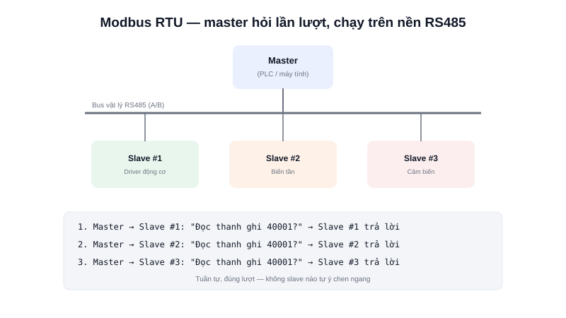

RS485 giải quyết vấn đề "làm sao truyền tín hiệu xa mà không nhiễu", nhưng nó không tự định nghĩa **ý nghĩa của dữ liệu** truyền qua — cần một giao thức ở tầng cao hơn để hai thiết bị hiểu chung "ngôn ngữ". **Modbus RTU** là giao thức phổ biến nhất cho việc này, chạy ngay trên nền vật lý RS485 (hoặc RS232) đã có sẵn.



## Khái niệm chính

Modbus RTU hoạt động theo mô hình **master-slave hỏi-đáp (polling)**: có đúng một thiết bị **master** (thường là PLC hoặc máy tính điều khiển) chủ động gửi yêu cầu, các thiết bị **slave** (cảm biến, driver động cơ, biến tần...) chỉ trả lời khi được hỏi đúng địa chỉ của mình — slave không bao giờ tự ý gửi dữ liệu.

Mỗi thiết bị slave có một địa chỉ (1-247) và lộ ra dữ liệu của nó dưới dạng các **thanh ghi (register)** được đánh số — ví dụ thanh ghi 40001 có thể là "tốc độ động cơ hiện tại", thanh ghi 40002 là "nhiệt độ". Master gửi yêu cầu kèm **function code** (mã lệnh, ví dụ đọc thanh ghi hay ghi thanh ghi) để thao tác đúng loại dữ liệu cần.

### Cấu trúc một khung Modbus RTU

```text
| Địa chỉ slave | Function code | Dữ liệu | CRC (kiểm tra lỗi) |
|     1 byte     |    1 byte     | N byte  |       2 byte        |
```

> **Tóm lại:** Modbus RTU không thay thế RS485 — nó là **giao thức chạy trên nền RS485**, định nghĩa cách đóng gói yêu cầu/phản hồi và đánh số thanh ghi, giúp thiết bị của các hãng khác nhau vẫn hiểu nhau nếu cùng "nói" Modbus.

## Nguyên lý hoạt động

```text
Master hỏi Slave 1: "Đọc thanh ghi 40001 (tốc độ)?"
Slave 1 trả lời: "1500 vòng/phút"
Master hỏi Slave 2: "Đọc thanh ghi 40001 (tốc độ)?"
Slave 2 trả lời: "1480 vòng/phút"
... (lặp lại tuần tự, không slave nào tự ý chen ngang)
```

Ví dụ đọc thanh ghi bằng một thư viện Modbus phổ biến (giả định trên vi điều khiển):

```c
uint16_t result[2];
// Đọc 2 thanh ghi (holding register) bắt đầu từ địa chỉ 0, từ slave có địa chỉ 1
modbus_read_holding_registers(slave_addr=1, start_reg=0, count=2, result);
```

Vì mọi giao tiếp đều do master khởi xướng và tuần tự (không có cơ chế trọng tài phức tạp như CAN), Modbus RTU đơn giản để triển khai nhưng tốc độ cập nhật chậm hơn khi số lượng slave lớn — mỗi slave chỉ được "nói" khi tới lượt bị hỏi. Đây là lý do Modbus RTU phù hợp cho việc đọc trạng thái/cấu hình driver động cơ, biến tần, cảm biến công nghiệp (tần suất cập nhật không cần quá cao), trong khi vòng điều khiển thời gian thực tần số cao (như PID tốc độ động cơ) vẫn nên dùng CAN hoặc kết nối trực tiếp.
