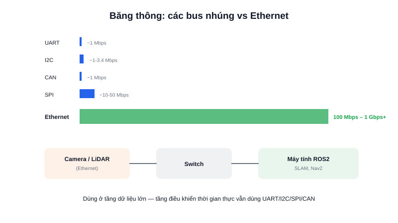

Tất cả các chuẩn đã nhắc tới — UART, I2C, SPI, CAN — đều được thiết kế cho dữ liệu **nhỏ và có tính thời gian thực** (vài byte tới vài chục byte, cần độ trễ thấp và xác định). Nhưng khi robot cần truyền **luồng hình ảnh từ camera**, hay để máy tính chạy SLAM/Nav2 giao tiếp với máy tính khác chạy nhận diện vật thể, không chuẩn nào trong số đó đủ băng thông — đây là lúc **Ethernet** vào cuộc.



## Khái niệm chính

Ethernet là chuẩn mạng có dây quen thuộc nhất thế giới (cổng RJ45 trên mọi router/switch), hoạt động dựa trên **địa chỉ MAC** (định danh phần cứng duy nhất) ở tầng thấp, và thường chạy chồng **giao thức TCP/IP** ở tầng trên để định tuyến dữ liệu bằng địa chỉ IP quen thuộc. Khác với các bus nhúng vốn dùng chung một đường dây cho mọi thiết bị, Ethernet dùng **switch** để định tuyến dữ liệu — mỗi gói tin chỉ đi tới đúng thiết bị nhận, không "phát tán" ra toàn bus.

### So băng thông với các chuẩn đã học

| Chuẩn | Tốc độ tối đa (thực tế) |
|---|---|
| UART | ~1 Mbps |
| I2C | ~1-3.4 Mbps |
| SPI | ~10-50 Mbps |
| CAN | ~1 Mbps |
| Ethernet | 100 Mbps – 1 Gbps+ |

> **Tóm lại:** Đổi lấy băng thông cực lớn, Ethernet cần một chip PHY chuyên dụng, tiêu thụ điện nhiều hơn, và toàn bộ ngăn xếp giao thức TCP/IP phức tạp hơn nhiều so với việc chỉ đọc/ghi một thanh ghi qua I2C — không phải lựa chọn "mặc định" cho mọi kết nối trong nhúng, chỉ dùng khi thực sự cần băng thông.

## Nguyên lý hoạt động

```text
Camera (Ethernet)  ──┐
                      ├──► Switch ──► Máy tính chạy ROS2 (SLAM, Nav2)
LiDAR (Ethernet)   ──┘             (mỗi gói tin định tuyến đúng đích,
                                     không "phát" ra toàn bộ dây chung)
```

Trong kiến trúc phần mềm AMR, Ethernet thường xuất hiện ở **tầng cao nhất** — kết nối giữa các máy tính nhúng (Jetson, máy tính công nghiệp) chạy ROS2, camera IP, LiDAR tốc độ cao — trong khi tầng thấp (giữa MCU và động cơ/cảm biến đơn giản) vẫn dùng UART/I2C/SPI/CAN vì đủ nhanh, rẻ hơn, và tiêu thụ điện thấp hơn nhiều. Một AMR hoàn chỉnh gần như luôn kết hợp cả hai lớp: bus nhúng ở tầng điều khiển thời gian thực, Ethernet ở tầng xử lý dữ liệu lớn.
