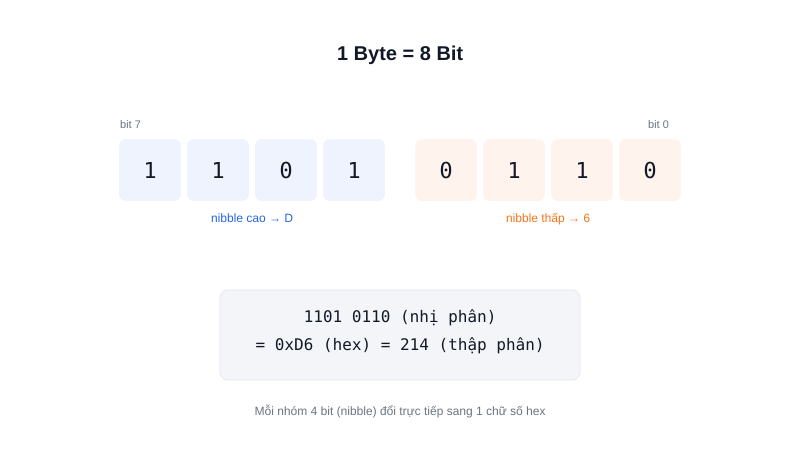

Mọi thứ trong lập trình nhúng — từ giá trị cảm biến đến lệnh điều khiển động cơ — cuối cùng đều quy về những con số 0 và 1. Hiểu rõ bit, byte, hệ nhị phân và hex là bước đầu tiên bắt buộc trước khi đọc bất kỳ datasheet vi điều khiển nào.



## Khái niệm chính

**Bit** (binary digit) là đơn vị dữ liệu nhỏ nhất, chỉ nhận 1 trong 2 giá trị: 0 hoặc 1 — tương ứng với "không có điện" và "có điện" ở tầng phần cứng.

**Byte** là một nhóm 8 bit đi liền nhau. Một byte biểu diễn được 2⁸ = 256 giá trị khác nhau (từ 0 đến 255) — đây là lý do kiểu dữ liệu `uint8_t` trong lập trình nhúng chỉ chứa được tối đa 255.

**Hệ nhị phân (binary)** biểu diễn số bằng chỉ hai chữ số 0 và 1, ngược với hệ thập phân (decimal) quen thuộc dùng 10 chữ số 0-9.

**Hệ thập lục phân (hexadecimal, viết tắt hex)** dùng 16 ký hiệu (0-9 và A-F) để biểu diễn số. Hex được ưa chuộng trong lập trình nhúng vì mỗi chữ số hex biểu diễn đúng 4 bit (1 nibble) — nên 1 byte luôn viết gọn bằng đúng 2 chữ số hex, dễ đọc hơn nhiều so với 8 chữ số 0/1.

### Vì sao không dùng thập phân cho luôn?

Vì phần cứng (thanh ghi, địa chỉ bộ nhớ, mặt nạ bit) được thiết kế theo nhóm bit — hex ánh xạ trực tiếp 1-1 với các nhóm 4-bit đó, còn thập phân thì không. Khi thấy `0x40` trong datasheet, bạn có thể suy ra ngay nhóm bit nào đang bật mà không cần đổi qua nhị phân trước.

> **Tóm lại:** 1 byte = 8 bit = đúng 2 chữ số hex — nắm chắc quy đổi này là đọc được mọi datasheet vi điều khiển.

## Nguyên lý hoạt động

Sơ đồ trên minh hoạ byte `11010110` được tách thành 2 nibble 4-bit: `1101` (=D) và `0110` (=6), ghép lại thành `0xD6`, tương đương 214 ở hệ thập phân.

```text
1101 0110  (nhị phân, 8 bit)
  D    6   (mỗi nibble → 1 chữ số hex)
   0xD6    → 214 (thập phân)
```

Trong code C/C++ nhúng, cả 3 cách viết này đều hợp lệ và biểu diễn cùng một giá trị:

```c
uint8_t value_bin = 0b11010110;
uint8_t value_hex = 0xD6;
uint8_t value_dec = 214;
```

Càng làm việc nhiều với thanh ghi vi điều khiển (set/clear từng bit riêng lẻ), bạn sẽ càng thấy hex và nhị phân tiện hơn thập phân rất nhiều.
