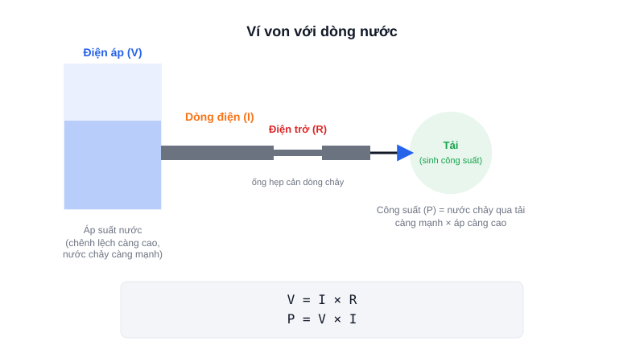

Trước khi cắm bất kỳ linh kiện nào vào mạch, bạn cần trả lời được: điện áp bao nhiêu là an toàn, dòng điện chạy qua bao nhiêu là vừa đủ, và công suất tiêu thụ có làm cháy linh kiện không. Ba đại lượng này là nền tảng của mọi mạch điện tử.



## Khái niệm chính

**Điện áp (Voltage, V, đơn vị Volt)** là sự chênh lệch điện thế giữa hai điểm — chính là "lực đẩy" khiến electron di chuyển. Ví von với nước: điện áp giống áp suất nước trong đường ống.

**Dòng điện (Current, I, đơn vị Ampere)** là lượng điện tích di chuyển qua một điểm trong một đơn vị thời gian — giống lưu lượng nước chảy qua ống.

**Điện trở (Resistance, R, đơn vị Ohm)** là mức độ cản trở dòng điện — giống độ hẹp của ống nước.

**Công suất (Power, P, đơn vị Watt)** là năng lượng tiêu thụ hoặc sinh ra trong một đơn vị thời gian — chính là "công" mà dòng nước làm được khi chảy qua tải (ví dụ quay một turbine).

### Định luật Ohm — công thức quan trọng nhất

```text
V = I × R
```

Từ đây suy ra công suất tiêu thụ trên một linh kiện:

```text
P = V × I
```

> **Tóm lại:** Áp đẩy dòng chảy qua điện trở (V = I×R); dòng chảy qua tải sinh ra công suất (P = V×I) — hai công thức này giải quyết được phần lớn bài toán chọn linh kiện.

## Nguyên lý hoạt động

Sơ đồ trên minh hoạ ví von: bể nước ở trên cao (điện áp) đẩy nước chảy qua một đoạn ống hẹp (điện trở) tới một turbine (tải tiêu thụ điện) — turbine quay càng mạnh (công suất càng lớn) khi áp suất càng cao hoặc ống càng rộng (điện trở càng nhỏ, dòng chảy càng lớn).

Ứng dụng thực tế khi làm robot: một động cơ DC ghi "12V, 2A" nghĩa là cần cấp đúng 12V và nó sẽ kéo dòng khoảng 2A khi hoạt động bình thường — công suất tiêu thụ ước tính 24W. Nguồn/pin bạn chọn phải cấp đủ dòng này, không chỉ đủ điện áp — đây là lỗi thường gặp nhất khi robot tự chế "yếu xìu" dù điện áp đo vẫn đúng.
