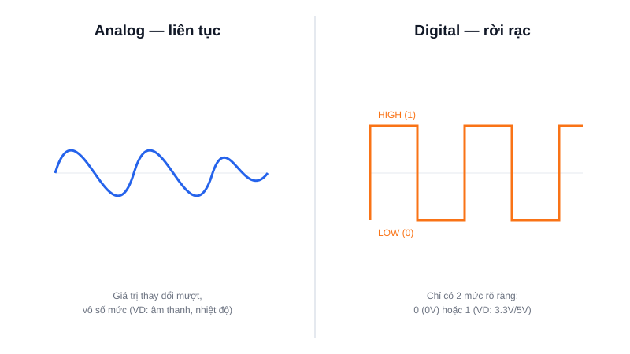

Thế giới thực (âm thanh, ánh sáng, nhiệt độ) vốn là các đại lượng biến đổi liên tục — nhưng vi điều khiển bên trong lại chỉ hiểu được 0 và 1. Hiểu sự khác biệt giữa tín hiệu digital và analog là chìa khoá để biết khi nào cần thêm một bộ chuyển đổi vào mạch.



## Khái niệm chính

**Tín hiệu Analog** biến đổi liên tục, có thể nhận vô số giá trị trong một khoảng — ví dụ điện áp ra của một cảm biến nhiệt độ có thể là 1.234V, 1.235V, 1.2351V... không giới hạn độ chính xác.

**Tín hiệu Digital** chỉ có một số hữu hạn mức rõ ràng — phổ biến nhất là 2 mức: LOW (0, thường ~0V) và HIGH (1, thường 3.3V hoặc 5V tuỳ vi điều khiển). Không có trạng thái "lưng chừng" hợp lệ.

### Vì sao digital lại chiếm ưu thế trong xử lý?

Vì tín hiệu digital chống nhiễu tốt hơn nhiều: dù nhiễu làm điện áp dao động chút ít, mạch vẫn chỉ cần phân biệt "gần 0" hay "gần mức cao" là đọc đúng — trong khi với analog, bất kỳ nhiễu nhỏ nào cũng làm sai lệch giá trị đo được.

> **Tóm lại:** Analog = vô số mức, dễ nhiễu; Digital = vài mức rõ ràng, chống nhiễu tốt — vi điều khiển xử lý digital tự nhiên, còn analog cần "phiên dịch" qua ADC.

## Nguyên lý hoạt động

Khi cần đọc một cảm biến analog (như cảm biến nhiệt độ, chiết áp), vi điều khiển dùng một khối phần cứng gọi là **ADC (Analog-to-Digital Converter)** để lượng tử hoá điện áp analog thành một con số digital gần đúng nhất:

```text
Điện áp analog (VD: 0 → 3.3V)
        ↓  ADC (VD: 12-bit)
Số nguyên digital (0 → 4095)
```

Độ phân giải ADC (số bit) quyết định độ chi tiết: ADC 12-bit chia 3.3V thành 4096 mức, mỗi mức chỉ khoảng 0.8mV — càng nhiều bit, đo càng mịn nhưng dữ liệu càng nặng. Ngược lại, khi cần xuất tín hiệu tương tự từ vi điều khiển (như điều khiển tốc độ động cơ mượt), người ta thường dùng PWM (một kiểu tín hiệu digital "giả lập" analog) thay vì DAC thật.
