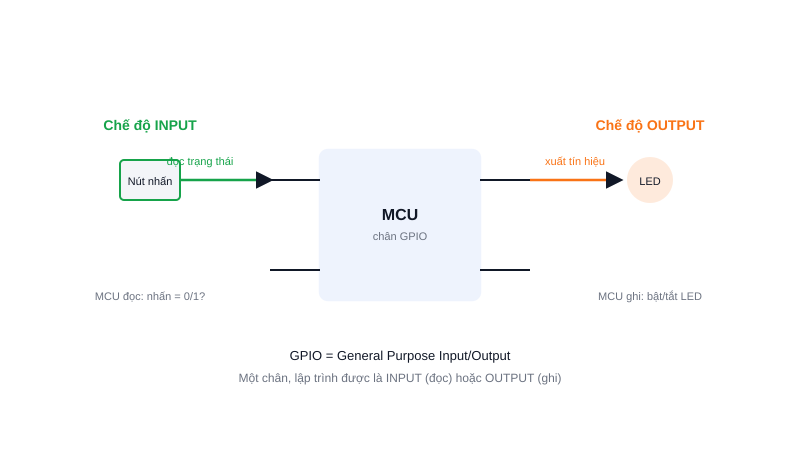

Mở bất kỳ sơ đồ chân (pinout) của STM32 hay ESP32 nào, bạn sẽ thấy phần lớn các chân đều được gọi là GPIO. Đây là loại chân cơ bản và được dùng nhiều nhất trong lập trình nhúng.



## Khái niệm chính

**GPIO (General Purpose Input/Output)** là chân đa năng trên vi điều khiển, có thể lập trình để hoạt động theo 1 trong 2 chế độ:

- **INPUT (đầu vào):** MCU đọc trạng thái điện áp trên chân — dùng để nhận tín hiệu từ nút nhấn, công tắc, cảm biến số...
- **OUTPUT (đầu ra):** MCU chủ động đặt chân ở mức HIGH hoặc LOW — dùng để điều khiển LED, relay, hoặc gửi tín hiệu tới linh kiện khác.

Điểm quan trọng: cùng một chân vật lý, bạn có thể cấu hình là INPUT hoặc OUTPUT tuỳ nhu cầu — đó là lý do gọi là "đa năng" (general purpose).

> **Tóm lại:** GPIO là 1 chân, 2 vai trò — đọc (INPUT) hoặc ghi (OUTPUT) — tất cả đều được quyết định trong code, không phải phần cứng cố định.

## Nguyên lý hoạt động

Ở chế độ INPUT, một nút nhấn nối vào chân GPIO; code liên tục hoặc theo ngắt sẽ đọc xem chân đang ở mức 0 hay 1 để biết nút có đang được nhấn không.

Ở chế độ OUTPUT, code ghi giá trị HIGH/LOW vào chân; phần cứng chân đó sẽ xuất đúng mức điện áp tương ứng ra ngoài, đủ để bật/tắt một LED.

```c
// STM32 HAL — ví dụ tối giản
HAL_GPIO_WritePin(GPIOA, GPIO_PIN_5, GPIO_PIN_SET);   // OUTPUT: bật LED
int state = HAL_GPIO_ReadPin(GPIOB, GPIO_PIN_0);       // INPUT: đọc nút nhấn
```

Một chân GPIO thực tế còn có nhiều chế độ nâng cao hơn (analog, PWM, giao tiếp UART/I2C/SPI...) — nhưng INPUT/OUTPUT số là hai chế độ nền tảng nhất, và gần như bài học đầu tiên của mọi khoá học vi điều khiển.
