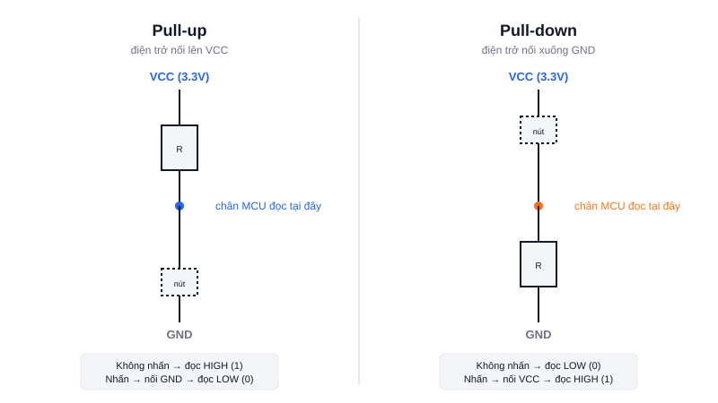

Nếu từng thấy code đọc nút nhấn trả về giá trị "nhảy lung tung" dù không chạm vào gì, rất có thể mạch của bạn đang thiếu điện trở pull-up hoặc pull-down — một trong những khái niệm hay bị bỏ qua nhất khi mới học GPIO.



## Khái niệm chính

Khi một chân GPIO cấu hình INPUT nhưng không nối vào đâu cả (nút nhấn hở mạch), chân đó ở trạng thái gọi là **floating** — điện áp trên chân không xác định, dễ bị nhiễu điện từ xung quanh làm đọc sai giá trị ngẫu nhiên giữa 0 và 1.

Giải pháp là thêm một điện trở "kéo" chân về một mức xác định khi không có gì tác động:

- **Pull-up:** điện trở nối chân lên VCC. Mặc định chân đọc HIGH; khi nút nhấn nối chân xuống GND, chân đọc LOW.
- **Pull-down:** điện trở nối chân xuống GND. Mặc định chân đọc LOW; khi nút nhấn nối chân lên VCC, chân đọc HIGH.

### Vì sao dùng điện trở thay vì nối thẳng?

Nếu nối thẳng VCC xuống GND qua nút nhấn mà không qua điện trở, lúc nhấn nút sẽ tạo **đoản mạch** (short circuit) — dòng điện tăng đột biến, có thể cháy nguồn hoặc chân MCU. Điện trở (thường 4.7kΩ–10kΩ) giới hạn dòng này ở mức an toàn.

> **Tóm lại:** Không bao giờ để chân INPUT floating — luôn pull-up hoặc pull-down, để chân luôn có một mức mặc định xác định khi chưa có tác động.

## Nguyên lý hoạt động

Hầu hết vi điều khiển hiện đại (STM32, ESP32...) đã có sẵn điện trở pull-up/pull-down **nội bộ**, bật được chỉ bằng 1 dòng code, không cần hàn thêm điện trở ngoài:

```c
// STM32 HAL — bật pull-up nội bộ cho chân input
GPIO_InitStruct.Pull = GPIO_PULLUP;
```

Quy tắc chọn nhanh: nếu code của bạn kỳ vọng "không nhấn = 0", dùng pull-down; nếu kỳ vọng "không nhấn = 1" (cách phổ biến hơn vì tận dụng được điện trở pull-up nội bộ có sẵn), dùng pull-up.
