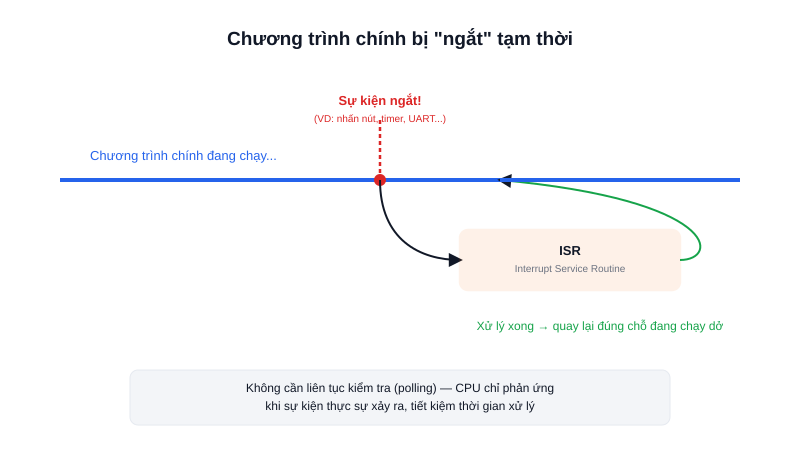

Hãy tưởng tượng đang nấu ăn (chương trình chính) thì có người bấm chuông cửa (sự kiện) — bạn tạm dừng bếp, ra mở cửa (xử lý sự kiện), rồi quay lại nấu tiếp đúng chỗ đang dở. Đó chính xác là cách một ngắt (interrupt) hoạt động trong vi điều khiển.



## Khái niệm chính

**Interrupt (ngắt)** là cơ chế cho phép một sự kiện phần cứng (nhấn nút, hết thời gian timer, dữ liệu UART đến...) tạm dừng chương trình chính đang chạy, nhảy tới thực thi một đoạn code xử lý riêng gọi là **ISR (Interrupt Service Routine)**, rồi quay lại đúng vị trí chương trình chính đang chạy dở trước đó.

### Interrupt khác gì Polling?

**Polling** là cách tiếp cận "hỏi liên tục": trong vòng lặp chính, code liên tục kiểm tra "nút đã nhấn chưa?" hàng nghìn lần mỗi giây dù phần lớn thời gian câu trả lời là "chưa" — tốn tài nguyên CPU một cách lãng phí.

**Interrupt** đảo ngược cách tiếp cận: CPU không cần hỏi, phần cứng sẽ tự "gõ cửa" CPU đúng lúc sự kiện xảy ra — CPU được rảnh tay làm việc khác trong lúc chờ.

> **Tóm lại:** Polling là "liên tục hỏi có chuyện gì chưa"; Interrupt là "cứ làm việc khác, có chuyện thì phần cứng tự báo".

## Nguyên lý hoạt động

```text
Chương trình chính đang chạy
         ↓  (sự kiện ngắt xảy ra)
   Lưu lại trạng thái hiện tại
         ↓
   Nhảy vào chạy ISR
         ↓
   Khôi phục trạng thái đã lưu
         ↓
Chương trình chính chạy tiếp, đúng chỗ đang dở
```

Vì ISR "chen ngang" chương trình chính bất kỳ lúc nào, nguyên tắc quan trọng nhất khi viết ISR là: **càng ngắn càng tốt**. ISR không nên chứa vòng lặp dài hay `delay()` — thường chỉ nên đặt một cờ báo hiệu (flag), rồi để chương trình chính xử lý chi tiết sau khi ISR kết thúc, tránh làm "treo" toàn hệ thống trong lúc ngắt đang chạy.
