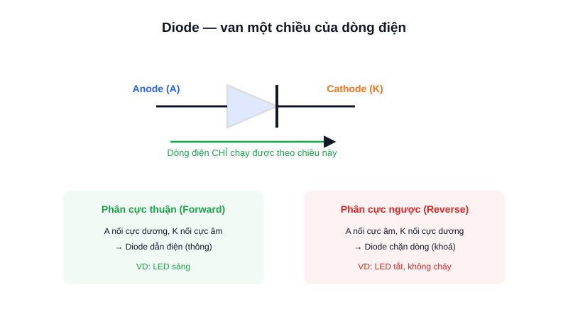

Trong hộp linh kiện của bất kỳ ai làm điện tử, diode luôn là một trong những món đầu tiên xuất hiện — một linh kiện nhỏ nhưng đóng vai trò như "van một chiều" cho dòng điện.



## Khái niệm chính

**Diode** là linh kiện bán dẫn 2 chân (Anode và Cathode), chỉ cho phép dòng điện chạy qua theo một chiều duy nhất — từ Anode sang Cathode. Theo chiều ngược lại, diode gần như chặn hoàn toàn dòng điện.

### Hai trạng thái phân cực

- **Phân cực thuận (forward bias):** Anode nối cực dương, Cathode nối cực âm → diode dẫn điện.
- **Phân cực ngược (reverse bias):** ngược lại → diode khoá, gần như không có dòng chạy qua.

> **Tóm lại:** Diode = van một chiều cho dòng điện — thông ở chiều thuận, khoá ở chiều ngược.

## Nguyên lý hoạt động

Ứng dụng phổ biến nhất trong lập trình nhúng:

- **LED** thực chất là một loại diode phát quang — phải cấp đúng chiều mới sáng.
- **Diode bảo vệ ngược dòng (reverse protection):** đặt nối tiếp nguồn cấp cho mạch, nếu ai đó cắm nhầm cực pin, diode sẽ chặn dòng thay vì để cháy mạch.
- **Diode chống dòng cảm ứng ngược (flyback diode):** gắn song song với cuộn dây relay/động cơ, bảo vệ transistor/MOSFET điều khiển khỏi xung điện áp cao sinh ra khi ngắt dòng đột ngột qua cuộn dây.

```text
Nguồn (+) → Diode → Mạch
              ↑
     cắm ngược pin → diode chặn dòng → mạch an toàn
```

Đây là lý do gần như mọi board mạch nghiêm túc đều có ít nhất 1 diode bảo vệ ngay đầu vào nguồn.
