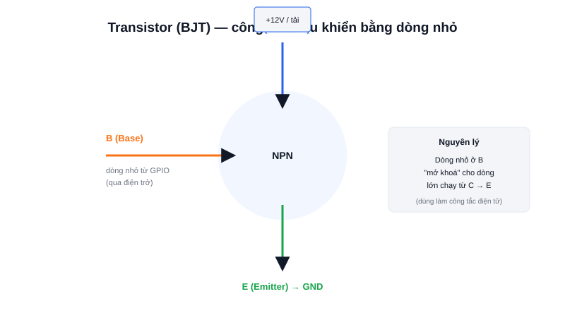

Muốn bật một động cơ 2A bằng chân GPIO chỉ xuất được vài chục mA? Đó chính xác là bài toán mà transistor được sinh ra để giải quyết.



## Khái niệm chính

**Transistor lưỡng cực (BJT — Bipolar Junction Transistor)** là linh kiện bán dẫn 3 chân: Base (B), Collector (C), Emitter (E). Với loại NPN phổ biến nhất, một dòng điện NHỎ chạy vào chân B sẽ "mở khoá" cho một dòng điện LỚN HƠN NHIỀU chạy từ C sang E.

### Vì sao gọi là "khuếch đại"?

Tỷ lệ giữa dòng C và dòng B (gọi là hệ số khuếch đại dòng, hFE) thường từ vài chục đến vài trăm lần — nghĩa là chỉ cần vài mA ở Base có thể điều khiển được vài trăm mA đến vài A ở Collector, tuỳ loại transistor.

> **Tóm lại:** Dòng nhỏ ở Base điều khiển dòng lớn ở Collector-Emitter — biến transistor thành công tắc điện tử hoặc bộ khuếch đại.

## Nguyên lý hoạt động

Sơ đồ trên minh hoạ cách dùng BJT làm công tắc điều khiển động cơ: chân GPIO của MCU (qua một điện trở hạn dòng) cấp dòng nhỏ vào Base; khi đó Collector-Emitter "thông", cho phép dòng lớn từ nguồn riêng (VD 12V) chạy qua động cơ.

```c
// Về bản chất: GPIO chỉ cần bật/tắt ở mức logic
HAL_GPIO_WritePin(GPIOA, GPIO_PIN_0, GPIO_PIN_SET);   // Base có dòng → transistor dẫn → động cơ chạy
```

Lưu ý quan trọng: KHÔNG bao giờ nối trực tiếp động cơ/tải công suất lớn vào chân GPIO — luôn phải qua transistor (hoặc MOSFET, relay) để tách dòng điều khiển nhỏ khỏi dòng công suất lớn, tránh cháy chân MCU.
