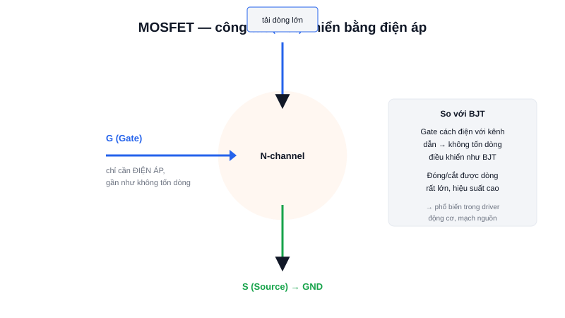

Mở bất kỳ driver động cơ hay mạch sạc pin nào, gần như chắc chắn bạn sẽ thấy MOSFET thay vì transistor BJT truyền thống — vì một lý do rất thực tế: hiệu suất.



## Khái niệm chính

**MOSFET (Metal-Oxide-Semiconductor Field-Effect Transistor)** cũng là công tắc điện tử 3 chân như BJT, nhưng gọi tên khác: Gate (G), Drain (D), Source (S). Điểm khác biệt cốt lõi: MOSFET được điều khiển bằng **điện áp** đặt vào Gate, chứ không phải dòng điện như Base của BJT.

### Vì sao điều khiển bằng điện áp lại quan trọng?

Gate của MOSFET cách điện với phần thân dẫn điện (qua một lớp oxit mỏng) — nên gần như KHÔNG có dòng điện chạy vào Gate ở trạng thái ổn định, chỉ cần đủ điện áp để "mở kênh" dẫn giữa Drain và Source. Điều này giúp MOSFET tổn hao ít năng lượng hơn BJT khi đóng cắt dòng lớn.

> **Tóm lại:** BJT cần DÒNG ở Base để dẫn; MOSFET chỉ cần ÁP ở Gate — ít tổn hao hơn, phù hợp cho dòng tải lớn và tần số đóng cắt cao.

## Nguyên lý hoạt động

Khi điện áp Gate-Source vượt một ngưỡng nhất định (gọi là V_GS(th)), kênh dẫn giữa Drain và Source hình thành, cho phép dòng điện chạy qua gần như không điện trở (R_DS(on) rất nhỏ ở MOSFET tốt).

```text
V_GS < ngưỡng  → MOSFET khoá (OFF)
V_GS ≥ ngưỡng  → MOSFET dẫn (ON), dòng chạy D → S
```

Vì đặc tính đóng/cắt nhanh và ít tổn hao, MOSFET là lựa chọn tiêu chuẩn cho driver động cơ DC/PWM, mạch Buck/Boost converter, và bất kỳ ứng dụng nào cần chuyển mạch tần số cao, dòng lớn.
