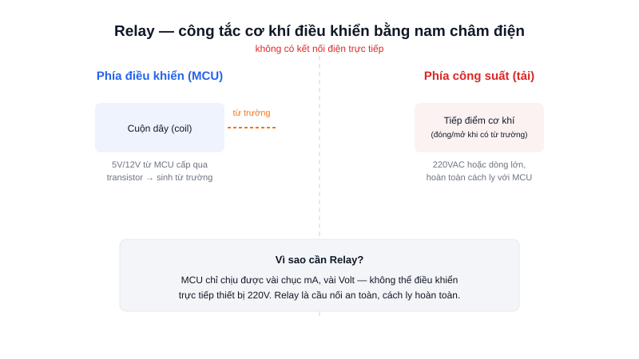

Muốn dùng ESP32 để bật/tắt một chiếc quạt điện 220V? Không bao giờ nối dây quạt trực tiếp vào chân GPIO — relay chính là linh kiện được sinh ra cho đúng bài toán này.

## Khái niệm chính

**Relay** là một công tắc cơ khí, nhưng được đóng/mở bằng lực từ thay vì tay người. Bên trong relay có một cuộn dây (coil): khi có dòng điện nhỏ chạy qua cuộn dây, nó sinh ra từ trường hút một tiếp điểm kim loại, đóng (hoặc mở) mạch điện phía bên kia.

### Hai phía hoàn toàn tách biệt

- **Phía điều khiển:** điện áp thấp (5V/12V), dòng nhỏ, nối trực tiếp với MCU (qua transistor vì cuộn dây cần dòng lớn hơn GPIO cấp được).
- **Phía công suất:** có thể là 220VAC hoặc dòng DC lớn, hoàn toàn cách ly về điện với phía điều khiển — chỉ liên kết với nhau qua từ trường và tiếp điểm cơ khí.

> **Tóm lại:** Relay dùng từ trường để đóng/mở một công tắc cơ khí — cách ly hoàn toàn mạch điều khiển (an toàn, điện áp thấp) khỏi mạch tải (nguy hiểm, điện áp cao).

## Nguyên lý hoạt động

Sơ đồ trên cho thấy 2 phía của relay không có kết nối điện trực tiếp nào — đường đứt nét ở giữa biểu thị ranh giới cách ly này. Khi MCU (qua transistor) cấp dòng cho cuộn dây, từ trường sinh ra hút tiếp điểm đóng lại, cho phép dòng điện 220V chạy qua tải.

Nhược điểm của relay cơ khí: đóng/cắt chậm (vài chục ms), có tiếng "tách" và mòn theo thời gian do tiếp điểm cơ khí — với ứng dụng cần đóng/cắt nhanh, tần số cao, người ta thường chọn **relay bán dẫn (SSR — Solid State Relay)** dùng optocoupler + triac/MOSFET thay cho tiếp điểm cơ khí.
