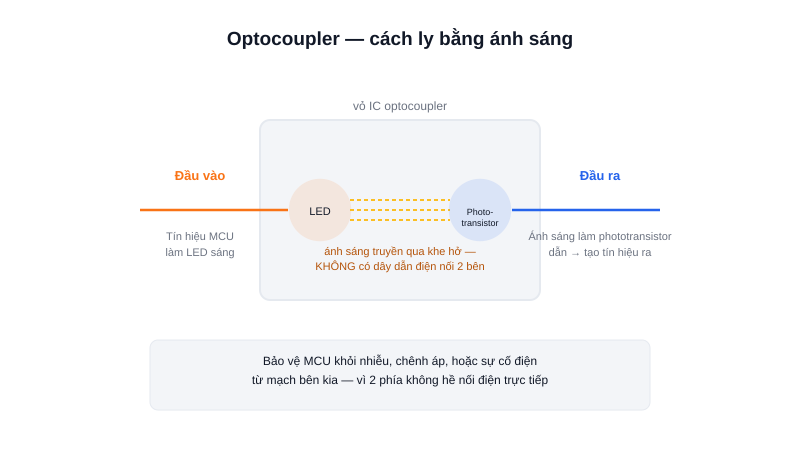

Khi cần truyền tín hiệu giữa hai mạch có mức điện áp hoặc "mặt đất" (GND) khác nhau — mà vẫn muốn tuyệt đối không có kết nối điện trực tiếp — optocoupler là giải pháp tiêu chuẩn.



## Khái niệm chính

**Optocoupler (bộ ghép quang)** là một IC nhỏ chứa 2 thành phần: một LED hồng ngoại ở phía đầu vào, và một phototransistor (transistor nhạy sáng) ở phía đầu ra — đặt đối diện nhau nhưng KHÔNG có kết nối điện, chỉ "giao tiếp" bằng ánh sáng.

### Cách hoạt động

Khi có tín hiệu ở đầu vào, LED bên trong phát sáng; ánh sáng này chiếu vào phototransistor phía đối diện, làm nó dẫn điện — tạo ra tín hiệu tương ứng ở phía đầu ra, dù hai bên hoàn toàn tách biệt về điện.

> **Tóm lại:** Optocoupler truyền tín hiệu bằng ánh sáng, không bằng dây dẫn điện — nhờ vậy cách ly hoàn toàn 2 mạch về điện áp và nhiễu.

## Nguyên lý hoạt động

```text
Tín hiệu vào → LED phát sáng → (khe hở, không dây dẫn) → Phototransistor nhận sáng → Tín hiệu ra
```

Ứng dụng thường gặp trong lập trình nhúng:

- Cách ly tín hiệu điều khiển khỏi mạch công suất (tương tự vai trò của relay, nhưng nhanh hơn nhiều và không có bộ phận cơ khí).
- Đọc tín hiệu từ mạch có mức điện áp khác (VD: đọc cảm biến công nghiệp 24V vào MCU 3.3V an toàn).
- Chống nhiễu, chống vòng lặp đất (ground loop) giữa các mạch nối với nhau qua khoảng cách xa.
