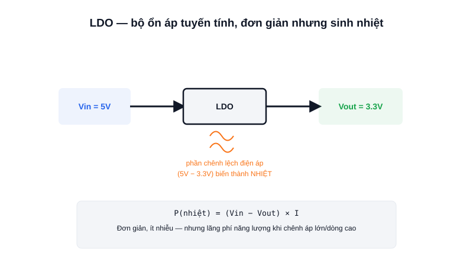

Hầu hết module cảm biến hay board vi điều khiển nhỏ đều có một chip dẹt 3 chân gần cổng nguồn — phần lớn trong số đó là LDO, linh kiện âm thầm "hạ áp" để nuôi cả mạch.



## Khái niệm chính

**LDO (Low-Dropout Regulator)** là bộ ổn áp tuyến tính, dùng để hạ một điện áp đầu vào xuống một điện áp đầu ra thấp hơn và ỔN ĐỊNH, bất kể điện áp đầu vào dao động nhẹ — ví dụ hạ 5V từ cổng USB xuống đúng 3.3V để nuôi vi điều khiển.

### "Low-Dropout" nghĩa là gì?

"Dropout" là phần chênh lệch điện áp tối thiểu cần có giữa đầu vào và đầu ra để LDO còn hoạt động đúng. LDO "dropout thấp" chỉ cần chênh lệch rất nhỏ (có loại dưới 0.3V) vẫn ra đúng điện áp mong muốn — hữu ích khi nguồn vào không dư dả nhiều (VD chạy bằng pin).

> **Tóm lại:** LDO ổn áp bằng cách "đốt" phần điện áp dư thành nhiệt — đơn giản, rẻ, ít nhiễu, nhưng lãng phí năng lượng khi chênh áp hoặc dòng tải lớn.

## Nguyên lý hoạt động

```text
P(nhiệt) = (Vin − Vout) × I
```

Vì phần năng lượng dư thừa biến hoàn toàn thành nhiệt, LDO chỉ phù hợp khi: chênh lệch điện áp nhỏ, dòng tải không quá lớn, hoặc khi ưu tiên mạch đơn giản/ít nhiễu (mạch tương tự nhạy cảm) hơn là hiệu suất. Khi cần hạ áp với chênh lệch lớn và dòng cao (VD 12V xuống 5V, dòng vài Ampe), nên dùng **Buck Converter** thay vì LDO để tránh sinh nhiệt quá mức.
