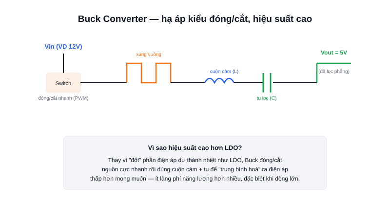

Khi cần hạ áp từ pin 12V xuống 5V để nuôi cả một dàn LED công suất, dùng LDO sẽ khiến board nóng ran và hao pin rất nhanh — đây là lúc Buck Converter phát huy tác dụng.



## Khái niệm chính

**Buck Converter** (bộ hạ áp kiểu chuyển mạch — switching regulator) hạ điện áp đầu vào xuống điện áp đầu ra thấp hơn, nhưng thay vì "đốt" phần điện áp dư thành nhiệt như LDO, nó đóng/cắt nguồn vào cực nhanh (hàng trăm nghìn lần/giây) rồi dùng cuộn cảm và tụ điện để "lọc phẳng" thành điện áp mong muốn.

### Vì sao hiệu suất cao hơn LDO?

Vì gần như toàn bộ năng lượng đầu vào được chuyển thành năng lượng đầu ra hữu ích (thường đạt 85-95% hiệu suất), thay vì lãng phí phần lớn thành nhiệt. Đánh đổi: mạch phức tạp hơn (cần cuộn cảm, tụ, IC điều khiển PWM), có thể sinh nhiễu điện từ do tần số đóng cắt cao.

> **Tóm lại:** Buck = hạ áp bằng đóng/cắt + lọc, hiệu suất cao; LDO = hạ áp bằng "đốt" điện áp dư, đơn giản nhưng kém hiệu quả khi chênh áp lớn.

## Nguyên lý hoạt động

Sơ đồ trên mô tả 3 bước: (1) một công tắc điện tử (MOSFET) đóng/cắt nguồn vào theo tần số cao tạo ra xung vuông, (2) cuộn cảm và tụ điện lọc xung vuông đó thành một điện áp một chiều tương đối phẳng, (3) tỷ lệ thời gian đóng/cắt (duty cycle) quyết định điện áp đầu ra trung bình là bao nhiêu.

```text
Vout ≈ Vin × duty_cycle   (duty_cycle từ 0 đến 1)
```

Đây là lý do hầu hết mạch nguồn cho robot (hạ áp từ pin Li-ion nhiều cell xuống 5V/3.3V để nuôi vi điều khiển) đều dùng module Buck converter thay vì LDO.
