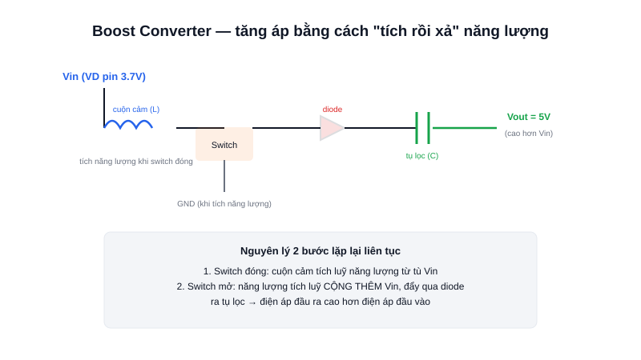

Một cell pin Li-ion chỉ có khoảng 3.7V — nhưng rất nhiều mạch (cảm biến, module WiFi, LED công suất) lại cần đúng 5V để hoạt động ổn định. Boost Converter là linh kiện giải quyết nghịch lý tưởng chừng vô lý này: tạo ra điện áp ra CAO HƠN điện áp vào.



## Khái niệm chính

**Boost Converter** (bộ tăng áp) là một loại switching regulator khác, hoạt động theo nguyên lý "tích luỹ rồi xả" năng lượng qua một cuộn cảm để tạo ra điện áp đầu ra cao hơn điện áp đầu vào.

### Vì sao điện áp ra lại "tự nhiên" cao hơn điện áp vào?

Vì trong giai đoạn "xả", năng lượng tích luỹ trong cuộn cảm CỘNG THÊM với điện áp nguồn vào rồi mới đẩy ra tụ lọc — về bản chất là cộng dồn năng lượng qua nhiều chu kỳ đóng/cắt rất nhanh, không vi phạm định luật bảo toàn năng lượng (dòng điện ở đầu ra sẽ nhỏ hơn dòng ở đầu vào tương ứng).

> **Tóm lại:** Boost tích năng lượng vào cuộn cảm khi switch đóng, rồi xả năng lượng đó cộng dồn với nguồn vào khi switch mở — kết quả là điện áp ra cao hơn điện áp vào.

## Nguyên lý hoạt động

Sơ đồ trên minh hoạ 2 giai đoạn lặp lại liên tục ở tần số cao:

```text
Bước 1 (switch đóng):  Vin nạp năng lượng vào cuộn cảm, dòng qua cuộn cảm tăng dần
Bước 2 (switch mở):    Cuộn cảm "xả" năng lượng đã tích, cộng với Vin,
                       đẩy qua diode ra tụ lọc → Vout > Vin
```

Ứng dụng phổ biến: mạch sạc dự phòng (power bank) tạo ra 5V từ pin Li-ion 3.7V, hay các mạch driver LED cần điện áp cao hơn nguồn pin cấp.
