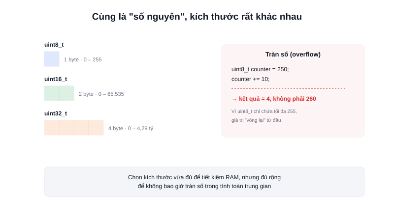

Trong lập trình ứng dụng thông thường, khai báo `int` hay `long` ít khi cần suy nghĩ nhiều — máy tính có hàng GB RAM. Nhưng trên một vi điều khiển chỉ có vài KB RAM, **mỗi byte đều có giá**, và kích thước thật sự của một kiểu dữ liệu (không phải chỉ cái tên) trở thành thứ bắt buộc phải hiểu rõ.



## Khái niệm chính

Một biến trong C là một vùng nhớ được đặt tên, có kiểu dữ liệu xác định **nó chiếm bao nhiêu byte** và **được diễn giải như thế nào** (số nguyên có dấu, không dấu, số thực...). Vấn đề với các kiểu cơ bản (`int`, `long`, `char`) là kích thước của chúng **không cố định** — phụ thuộc vào kiến trúc chip và trình biên dịch. Một `int` có thể là 2 byte trên vi điều khiển 8-bit đời cũ, nhưng lại là 4 byte trên ARM Cortex-M — cùng một dòng code, hai kết quả khác nhau.

### Kiểu dữ liệu độ rộng cố định (fixed-width types)

Để tránh sự mơ hồ này, code nhúng gần như luôn dùng các kiểu khai báo trong `<stdint.h>`, có kích thước **cố định trên mọi nền tảng**:

| Kiểu | Kích thước | Khoảng giá trị |
|---|---|---|
| `uint8_t` | 1 byte | 0 – 255 |
| `int8_t` | 1 byte | -128 – 127 |
| `uint16_t` | 2 byte | 0 – 65.535 |
| `int16_t` | 2 byte | -32.768 – 32.767 |
| `uint32_t` | 4 byte | 0 – 4.294.967.295 |
| `float` | 4 byte | ~7 chữ số thập phân có nghĩa |

> **Tóm lại:** Dùng `uint8_t`, `int16_t`... thay vì `int` không phải để "cho giống code mẫu" — mà vì nó đảm bảo bạn biết chính xác biến đang chiếm bao nhiêu byte, quan trọng khi RAM chỉ có 2–512KB và khi ánh xạ trực tiếp vào thanh ghi phần cứng (vốn có độ rộng cố định 8/16/32-bit).

## Nguyên lý hoạt động

Chọn sai kiểu dữ liệu gây ra hai loại lỗi rất phổ biến trong code nhúng:

```c
uint8_t counter = 250;
counter += 10;          // Kết quả: 4, không phải 260 — "tràn số" (overflow)
                         // vì uint8_t chỉ chứa được tối đa 255

int16_t adc_raw = 700;
uint32_t scaled = adc_raw * 1000;   // Nếu adc_raw là int16_t, phép nhân có thể
                                     // tràn trước khi gán — cần ép kiểu cẩn thận:
uint32_t scaled_safe = (uint32_t)adc_raw * 1000;
```

Việc chọn `uint8_t` cho một biến đếm vòng lặp chạy tới 300 lần, hay quên ép kiểu trước khi nhân, là lỗi rất khó phát hiện vì code vẫn biên dịch bình thường — chỉ sai kết quả lúc chạy thật, thường ngay giữa một vòng lặp đọc cảm biến hoặc tính PID.

Ghi nhớ khi chọn kiểu: chỉ dùng kích thước vừa đủ cho khoảng giá trị thực tế cần chứa (tiết kiệm RAM quý giá), nhưng đủ rộng để không bao giờ tràn số trong các phép tính trung gian.
