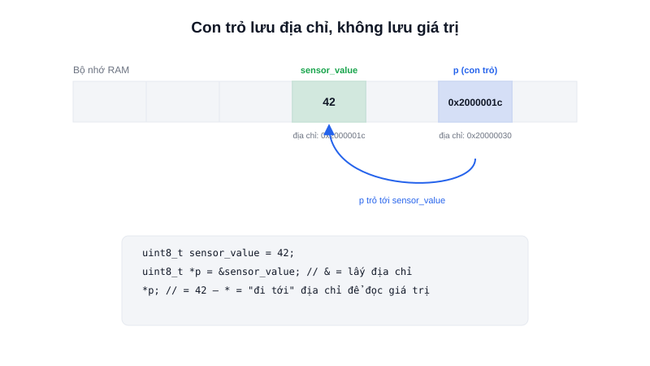

Con trỏ (pointer) thường được xem là khái niệm "đáng sợ" nhất khi học C — nhưng trong lập trình nhúng, nó gần như không thể tránh: mọi thanh ghi phần cứng, mọi vùng nhớ ánh xạ ngoại vi, đều được truy cập **thông qua địa chỉ**, và địa chỉ chính là thứ một con trỏ lưu giữ.



## Khái niệm chính

Mỗi biến trong chương trình được lưu ở một **địa chỉ** cụ thể trong RAM. Một con trỏ là một biến đặc biệt — thay vì lưu giá trị trực tiếp, nó lưu **địa chỉ** của một biến khác.

```c
uint8_t sensor_value = 42;
uint8_t *p = &sensor_value;  // p lưu ĐỊA CHỈ của sensor_value, không lưu 42

printf("%d\n", sensor_value); // 42
printf("%p\n", p);            // ví dụ: 0x2000001c (một địa chỉ RAM)
printf("%d\n", *p);           // 42 — "đi tới" địa chỉ p đang trỏ để lấy giá trị
```

Hai toán tử cần nhớ: `&` (address-of) lấy địa chỉ của một biến; `*` (dereference) đi tới địa chỉ đó để đọc/ghi giá trị thật sự nằm ở đó.

### Vì sao lập trình nhúng dùng con trỏ nhiều hơn hẳn

Ba lý do khiến con trỏ xuất hiện dày đặc trong code nhúng:

1. **Truy cập thanh ghi phần cứng** — một thanh ghi GPIO chỉ là một địa chỉ bộ nhớ cố định; để ghi vào nó, phải "ép" một con trỏ trỏ đúng địa chỉ đó rồi ghi giá trị qua nó.
2. **Truyền dữ liệu lớn không copy** — với RAM giới hạn, truyền cả một `struct` cảm biến 50 byte vào hàm bằng giá trị nghĩa là copy 50 byte mỗi lần gọi; truyền con trỏ chỉ tốn 4 byte (địa chỉ) dù dữ liệu lớn cỡ nào.
3. **Con trỏ hàm cho callback/ngắt** — đăng ký một hàm để chip tự gọi khi có sự kiện (ngắt, timer) cần lưu **địa chỉ của hàm đó**, chính là một con trỏ.

> **Tóm lại:** Con trỏ không phải "mẹo nâng cao" — nó là cách C biểu diễn địa chỉ bộ nhớ, và trong nhúng, địa chỉ bộ nhớ chính là cách duy nhất để chạm vào phần cứng thật.

## Nguyên lý hoạt động

Ví dụ kinh điển: ghi trực tiếp vào một thanh ghi GPIO bằng cách "ép" một con trỏ trỏ tới đúng địa chỉ vật lý của nó (đơn giản hoá từ cách STM32 HAL làm bên dưới):

```c
#define GPIOA_ODR  (*(volatile uint32_t *)0x40020014)

GPIOA_ODR |= (1 << 5);   // Bật bit thứ 5 → chân PA5 lên mức cao
```

`0x40020014` không phải một ô nhớ RAM thông thường — đó là địa chỉ vật lý của thanh ghi điều khiển output trên chip. Từ khoá `volatile` báo cho trình biên dịch biết: giá trị ở địa chỉ này **có thể thay đổi bởi phần cứng bất cứ lúc nào**, không được tối ưu hoá bỏ qua việc đọc/ghi lại như với biến RAM thường.

```text
Biến sensor_value (RAM, địa chỉ 0x2000001c)
         ▲
         │  con trỏ p lưu địa chỉ này
         │
    uint8_t *p = &sensor_value;
```

Lỗi phổ biến nhất với con trỏ là **dereference một con trỏ chưa được gán địa chỉ hợp lệ** (con trỏ NULL hoặc "hoang" — trỏ tới vùng nhớ ngẫu nhiên) — trên máy tính thường gây crash ngay lập tức và dễ phát hiện; trên vi điều khiển không có hệ điều hành bảo vệ bộ nhớ, lỗi này có thể khiến chip "treo" âm thầm hoặc ghi đè dữ liệu ở vùng nhớ hoàn toàn không liên quan.
