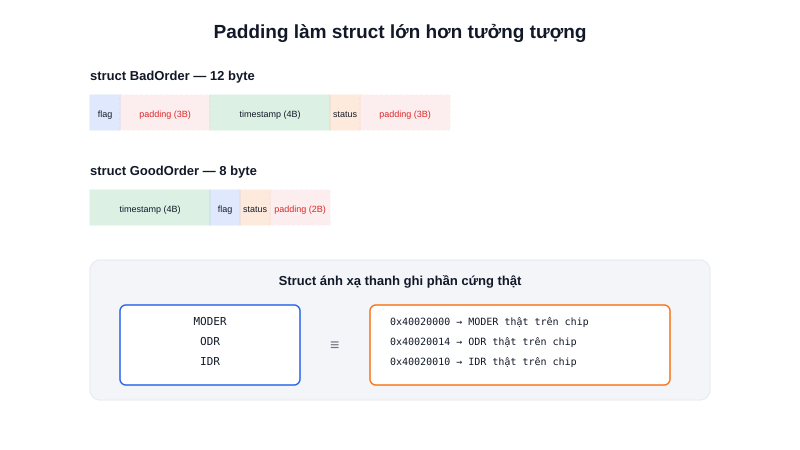

Khi cần lưu nhiều thông tin liên quan tới nhau — ví dụ dữ liệu đọc từ một IMU gồm cả gia tốc, vận tốc góc và nhiệt độ — khai báo từng biến rời rạc rất dễ nhầm lẫn. **Struct** giải quyết đúng vấn đề này: gom chúng vào một khối duy nhất, có tên và cấu trúc rõ ràng.



## Khái niệm chính

`struct` định nghĩa một kiểu dữ liệu mới, gồm nhiều **thành viên (member)** có kiểu khác nhau, được truy cập qua tên:

```c
typedef struct {
    float accel_x;
    float accel_y;
    float accel_z;
    uint8_t temperature;
} ImuData;

ImuData imu;
imu.accel_x = 0.98f;
imu.temperature = 27;
```

Các thành viên của struct được lưu **liên tục trong bộ nhớ**, theo đúng thứ tự khai báo — đây là chi tiết quan trọng, không chỉ là tổ chức code cho gọn.

### Padding — struct không "nhỏ như tưởng"

Trình biên dịch thường **chèn thêm byte đệm (padding)** giữa các thành viên để mỗi thành viên nằm ở địa chỉ chia hết cho kích thước của nó (căn chỉnh bộ nhớ — alignment), vì CPU đọc dữ liệu căn chỉnh đúng sẽ nhanh hơn. Kết quả là `sizeof(struct)` có thể **lớn hơn** tổng kích thước các thành viên cộng lại:

```c
struct BadOrder {
    uint8_t  flag;     // 1 byte + 3 byte padding
    uint32_t timestamp; // 4 byte
    uint8_t  status;    // 1 byte + 3 byte padding
};  // sizeof = 12 byte, dù dữ liệu thật chỉ có 6 byte!

struct GoodOrder {
    uint32_t timestamp; // 4 byte
    uint8_t  flag;      // 1 byte
    uint8_t  status;    // 1 byte + 2 byte padding
};  // sizeof = 8 byte — tiết kiệm hơn nhờ sắp xếp từ lớn đến nhỏ
```

> **Tóm lại:** Sắp xếp thành viên struct từ kiểu lớn đến kiểu nhỏ giúp giảm padding lãng phí — đáng để ý khi RAM chỉ có vài chục KB và có hàng trăm instance của struct đó.

## Nguyên lý hoạt động

Ứng dụng quan trọng nhất của struct trong nhúng là **ánh xạ toàn bộ khối thanh ghi của một ngoại vi phần cứng** thành một struct, rồi "ép" một con trỏ trỏ đúng địa chỉ cơ sở của ngoại vi đó — mỗi thành viên của struct khi đó tương ứng chính xác với một thanh ghi thật trên chip:

```c
typedef struct {
    volatile uint32_t MODER;   // Chế độ chân (input/output)
    volatile uint32_t ODR;     // Giá trị output
    volatile uint32_t IDR;     // Giá trị input đọc được
} GPIO_TypeDef;

#define GPIOA  ((GPIO_TypeDef *)0x40020000)  // Địa chỉ cơ sở của khối GPIOA

GPIOA->ODR |= (1 << 5);   // Ghi thẳng vào thanh ghi ODR thật trên chip
```

Đây chính xác là cách thư viện HAL của STM32 hoạt động bên trong — mỗi ngoại vi (GPIO, Timer, UART...) đều được mô tả bằng một struct như vậy, giúp code đọc dễ hiểu (`GPIOA->ODR`) thay vì phải nhớ và gõ tay từng địa chỉ hex.
