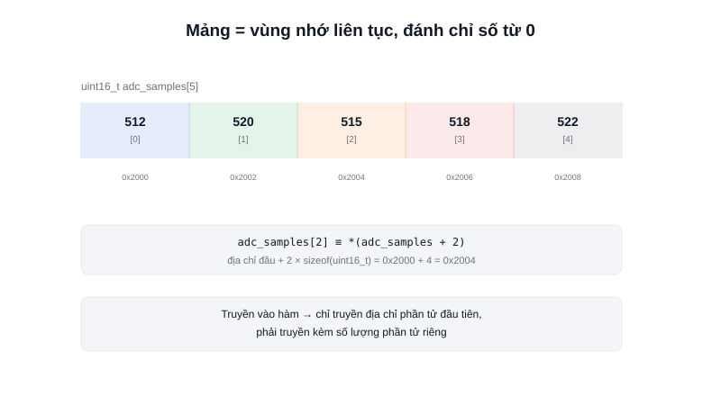

Buffer nhận dữ liệu UART, bảng tra giá trị sin có sẵn, danh sách các mẫu cảm biến gần nhất — hầu hết đều dùng cùng một cấu trúc dữ liệu cơ bản: **mảng (array)**. Trong C, mảng đơn giản hơn nhiều so với các ngôn ngữ khác, nhưng chính sự đơn giản đó lại là thứ cần hiểu kỹ.



## Khái niệm chính

Một mảng trong C là một dãy các phần tử **cùng kiểu dữ liệu**, được cấp phát **liên tục** trong bộ nhớ — không có khoảng trống giữa các phần tử.

```c
uint16_t adc_samples[5] = {512, 520, 515, 518, 522};
```

Nếu `adc_samples` bắt đầu ở địa chỉ `0x2000` và mỗi `uint16_t` chiếm 2 byte, thì `adc_samples[2]` nằm ở địa chỉ `0x2000 + 2*2 = 0x2004`. Đây không phải chi tiết cần nhớ để dùng mảng — nó chính là **cách C tính toán chỉ số**, và là lý do vì sao thao tác `arr[i]` thực chất tương đương với phép tính con trỏ `*(arr + i)`.

### Mảng "suy biến" thành con trỏ khi truyền vào hàm

Khi truyền một mảng vào hàm, C không copy toàn bộ mảng — nó chỉ truyền **địa chỉ phần tử đầu tiên**, tức mảng "suy biến" (decay) thành một con trỏ. Hệ quả quan trọng: hàm nhận mảng **không biết được kích thước** của nó, phải truyền kèm một tham số riêng:

```c
void print_samples(uint16_t *samples, size_t count) {
    for (size_t i = 0; i < count; i++) {
        printf("%d\n", samples[i]);
    }
}

print_samples(adc_samples, 5);  // phải truyền kèm số lượng phần tử
```

> **Tóm lại:** Mảng trong C không "biết" kích thước của chính nó khi đã truyền vào hàm khác — luôn phải truyền kèm độ dài, khác hẳn với mảng động (`std::vector`, list Python) ở các ngôn ngữ khác vốn tự lưu kích thước.

## Nguyên lý hoạt động

```text
Địa chỉ:   0x2000    0x2002    0x2004    0x2006    0x2008
           ┌────────┬────────┬────────┬────────┬────────┐
Giá trị:   │  512   │  520   │  515   │  518   │  522   │
           └────────┴────────┴────────┴────────┴────────┘
Chỉ số:    adc_samples[0]    [1]      [2]      [3]      [4]
```

Vì kích thước mảng **cố định tại thời điểm biên dịch** (`uint16_t adc_samples[5]` luôn là 5 phần tử suốt vòng đời chương trình), mảng tĩnh kiểu này gần như luôn được ưu tiên trong code nhúng thay vì cấp phát động (`malloc`) — tránh hoàn toàn rủi ro phân mảnh bộ nhớ (heap fragmentation) khi chương trình phải chạy ổn định liên tục hàng tháng trời trên một con robot, không có hệ điều hành nào dọn rác giúp.
