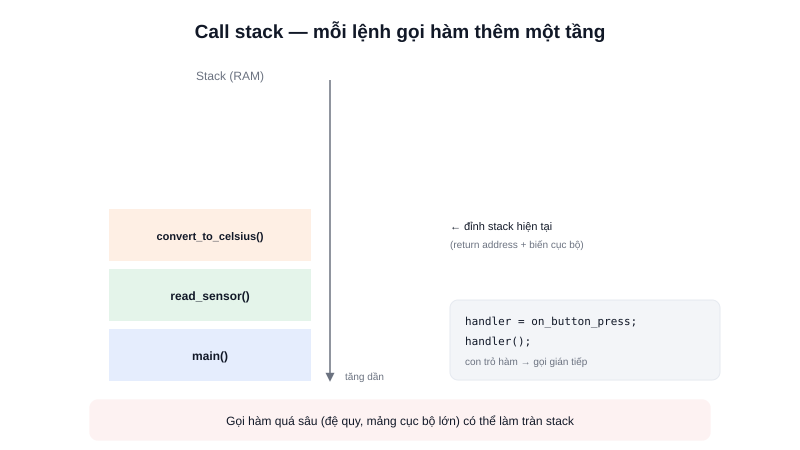

Hàm (function) là khái niệm quen thuộc với bất kỳ ai từng viết code — nhưng trong lập trình nhúng, hai khía cạnh của hàm thường bị bỏ qua lại chính là thứ hay gây lỗi nhất: **call stack hoạt động ra sao**, và **hàm cũng có thể được truyền đi như một giá trị** thông qua con trỏ hàm.



## Khái niệm chính

Một hàm nhận tham số đầu vào, thực hiện tính toán, và có thể trả về giá trị:

```c
int16_t clamp(int16_t value, int16_t min, int16_t max) {
    if (value < min) return min;
    if (value > max) return max;
    return value;
}
```

Có hai cách truyền tham số: **truyền theo giá trị** (hàm nhận một bản copy, sửa trong hàm không ảnh hưởng biến gốc — như ví dụ trên) và **truyền theo con trỏ** (hàm nhận địa chỉ, có thể sửa trực tiếp biến gốc của người gọi, và tránh copy dữ liệu lớn — xem thêm bài Pointer).

### Call stack — nơi các lệnh gọi hàm được "xếp chồng"

Mỗi lần một hàm được gọi, một **stack frame** mới được đẩy (push) lên đỉnh ngăn xếp, chứa: địa chỉ trở về (return address), tham số, và biến cục bộ của hàm đó. Khi hàm kết thúc, frame này bị gỡ (pop) khỏi ngăn xếp, chương trình quay lại đúng vị trí đã gọi.

> **Tóm lại:** Mỗi lệnh gọi hàm tốn một khoảng RAM stack nhất định cho tới khi hàm đó return — gọi hàm quá sâu (đệ quy không kiểm soát, hoặc khai báo mảng cục bộ lớn trong hàm) có thể làm tràn stack, một trong những lỗi khó debug nhất trên vi điều khiển vì nó thường gây "treo máy" không rõ nguyên nhân.

## Nguyên lý hoạt động

```text
main() gọi read_sensor()
  → Push stack frame của read_sensor()
      read_sensor() gọi convert_to_celsius()
        → Push stack frame của convert_to_celsius()
        ← Pop khi convert_to_celsius() return
  ← Pop khi read_sensor() return
main() tiếp tục chạy
```

### Con trỏ hàm — dùng khi cần "truyền một hành vi"

Một con trỏ hàm lưu **địa chỉ của một hàm**, cho phép gọi hàm đó gián tiếp — cơ chế nền tảng của mọi callback trong nhúng, ví dụ đăng ký hàm xử lý ngắt:

```c
typedef void (*InterruptHandler)(void);

void on_button_press(void) {
    // Xử lý khi nút được nhấn
}

InterruptHandler handler = on_button_press;
handler();  // Gọi on_button_press() một cách gián tiếp
```

Trong thực tế, đây chính là cách các thư viện HAL đăng ký hàm callback cho ngắt hoặc timer: bạn viết một hàm theo đúng "khuôn" (signature) mà thư viện yêu cầu, truyền địa chỉ hàm đó vào, và phần cứng sẽ tự gọi lại đúng lúc sự kiện xảy ra — không khác gì cách JavaScript hay Python truyền hàm làm callback, chỉ khác là ở C phải khai báo tường minh qua con trỏ hàm.
