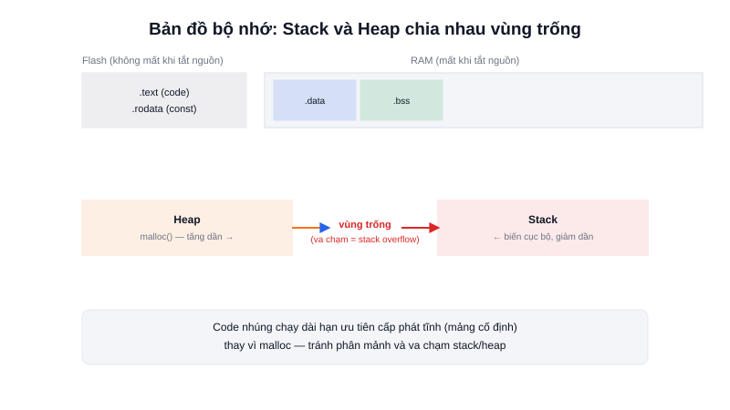

Một chương trình C sau khi biên dịch không nằm gọn trong "một cục" duy nhất — nó được chia thành nhiều vùng bộ nhớ riêng biệt, mỗi vùng nằm ở khu vực vật lý khác nhau trên chip (Flash hay RAM) và có vòng đời khác nhau. Không hiểu bản đồ này là nguyên nhân của phần lớn lỗi "chương trình tự nhiên treo" khó debug trong nhúng.



## Khái niệm chính

Trên một vi điều khiển, bộ nhớ tách biệt rõ giữa hai loại vật lý:

- **Flash** — bộ nhớ không mất dữ liệu khi tắt nguồn, chứa **code đã biên dịch** (`.text`) và các hằng số (`.rodata`, ví dụ chuỗi ký tự, bảng tra cứu `const`)
- **RAM** — bộ nhớ mất dữ liệu khi tắt nguồn, chia tiếp thành 4 vùng:
  - `.data` — biến toàn cục **đã khởi tạo giá trị** (`int count = 5;`)
  - `.bss` — biến toàn cục **chưa khởi tạo**, tự động gán 0 khi khởi động
  - **Heap** — vùng cấp phát động (`malloc`), phát triển **tăng dần** từ đầu RAM còn trống
  - **Stack** — vùng chứa lệnh gọi hàm và biến cục bộ, phát triển **giảm dần** từ cuối RAM

### Stack và Heap "đấu đầu" nhau

Vì stack lớn dần từ trên xuống trong khi heap lớn dần từ dưới lên, cả hai cùng chia sẻ **một khoảng RAM trống ở giữa**. Nếu một trong hai (hoặc cả hai) phình quá lớn, chúng va vào nhau — gọi là **stack overflow** — ghi đè dữ liệu lẫn nhau và khiến chương trình chạy sai một cách hoàn toàn khó đoán, không phải lúc nào cũng crash ngay lập tức.

> **Tóm lại:** RAM trên MCU chỉ vài KB đến vài trăm KB — không có "bộ nhớ ảo" hay hệ điều hành cứu hộ khi hết RAM như trên máy tính. Hết RAM trên MCU thường không báo lỗi rõ ràng, chỉ đơn giản là chương trình bắt đầu hành xử sai.

## Nguyên lý hoạt động

```text
Địa chỉ thấp                                          Địa chỉ cao
┌──────────┬──────────┬──────────┬─────►      ◄─────┬──────────┐
│  .data   │  .bss    │  Heap    │  (trống)  │  Stack   │
│ (đã gán) │ (auto=0) │ malloc() │  giữa 2   │ biến cục bộ,│
│          │          │ tăng dần │  vùng     │ tăng ngược   │
└──────────┴──────────┴──────────┴─────────────┴──────────┘
```

Vì rủi ro va chạm stack/heap và vì **phân mảnh bộ nhớ (fragmentation)** — cấp phát/giải phóng `malloc`/`free` liên tục theo thời gian để lại các khoảng trống nhỏ rải rác, khiến dần dần không còn khối liền đủ lớn dù tổng RAM trống vẫn còn — code nhúng chạy dài hạn (robot chạy liên tục hàng tháng, không được reboot mỗi ngày như máy chủ) gần như luôn tránh `malloc` sau khi khởi động xong, ưu tiên **cấp phát tĩnh** (mảng kích thước cố định, biến toàn cục) được xác định ngay từ lúc biên dịch — đổi lại sự linh hoạt để lấy tính xác định (determinism): biết chắc chương trình sẽ không bao giờ hết RAM giữa chừng sau nhiều ngày chạy.
