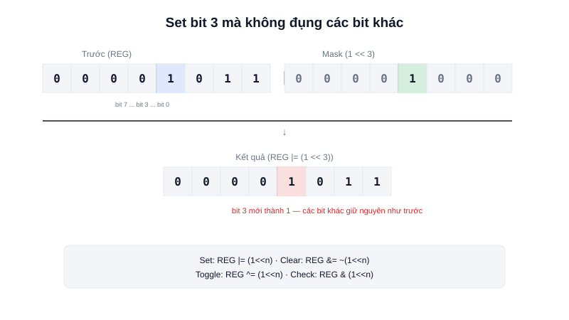

Một thanh ghi phần cứng 32-bit thường không chỉ chứa một giá trị — nó đóng gói **hàng chục cờ và cấu hình độc lập**, mỗi bit một ý nghĩa riêng, để tiết kiệm không gian địa chỉ. Đọc/ghi đúng một bit mà không ảnh hưởng tới các bit còn lại đòi hỏi bốn thao tác bit cơ bản mà bất kỳ ai viết code nhúng cũng cần thuộc lòng.



## Khái niệm chính

C cung cấp các toán tử làm việc trực tiếp trên từng bit của một số nguyên: `&` (AND), `|` (OR), `^` (XOR), `~` (NOT/đảo bit), `<<` và `>>` (dịch trái/phải). Kết hợp chúng với `(1 << n)` — một số chỉ có đúng bit thứ `n` bằng 1, còn lại là 0 — tạo ra bốn thao tác kinh điển:

| Thao tác | Code | Ý nghĩa |
|---|---|---|
| Set bit (bật) | `REG \|= (1 << n)` | Đặt bit n = 1, giữ nguyên các bit khác |
| Clear bit (tắt) | `REG &= ~(1 << n)` | Đặt bit n = 0, giữ nguyên các bit khác |
| Toggle bit (đảo) | `REG ^= (1 << n)` | Đảo ngược bit n (0→1 hoặc 1→0) |
| Check bit (kiểm tra) | `if (REG & (1 << n))` | Kiểm tra bit n đang là 0 hay 1 |

### Vì sao không thể gán trực tiếp

Một lỗi phổ biến của người mới là viết `REG = (1 << 5);` để "bật chân 5" — nhưng phép gán trực tiếp này **xoá toàn bộ các bit khác về 0**, tắt luôn mọi cấu hình khác đang bật trong cùng thanh ghi đó. Đây là lý do các thao tác set/clear luôn dùng `|=` và `&=` kết hợp mask, thay vì gán `=` trực tiếp.

> **Tóm lại:** `|=` để bật mà không đụng bit khác, `&= ~(...)` để tắt mà không đụng bit khác, `^=` để đảo trạng thái, `&` (không gán) để chỉ đọc kiểm tra. Nhầm một trong bốn ký hiệu này là nguồn lỗi rất phổ biến khi cấu hình thanh ghi.

## Nguyên lý hoạt động

Ví dụ thanh ghi cấu hình 8-bit của một ngoại vi giả định, mỗi bit là một cờ độc lập:

```c
// Bit 3 = bật ngắt (interrupt enable), các bit khác giữ nguyên
CONFIG_REG |= (1 << 3);

// Tắt bit 3, không ảnh hưởng bit 0, 1, 2, 4-7
CONFIG_REG &= ~(1 << 3);

// Kiểm tra bit 3 đang bật hay tắt
if (CONFIG_REG & (1 << 3)) {
    // Ngắt đang được bật
}
```

```text
Trước:  0 0 0 0 1 0 1 1     (bit 3 đang = 0)
Set(3): 0 0 0 0 1 0 1 1  |  0 0 0 0 1 0 0 0  =  0 0 0 0 1 0 1 1
                                                  ↑ chỉ bit 3 đổi thành 1
```

Kỹ thuật này xuất hiện ở khắp nơi trong nhúng: bật/tắt từng chân GPIO trong thanh ghi cấu hình chế độ, kiểm tra cờ "dữ liệu đã sẵn sàng" trong thanh ghi trạng thái UART, hay đóng gói nhiều giá trị boolean vào một `uint8_t` duy nhất thay vì dùng 8 biến `bool` riêng — tiết kiệm RAM khi có hàng trăm cờ trạng thái cần theo dõi.
