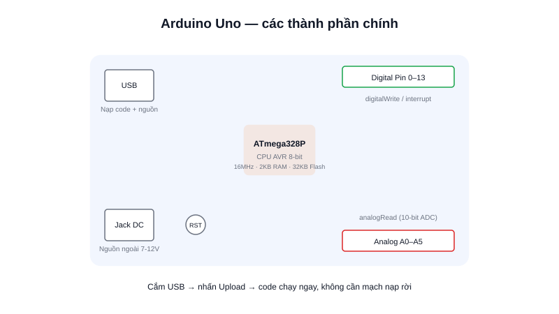

Khi mới bắt đầu học vi điều khiển, gần như ai cũng nghe tới **Arduino** đầu tiên. Nhưng Arduino không phải tên một con chip — đó là tên của cả một hệ sinh thái: phần cứng (board), phần mềm (Arduino IDE) và một thư viện khổng lồ do cộng đồng đóng góp, tất cả xoay quanh việc giúp người mới điều khiển được phần cứng thật nhanh nhất có thể.



## Khái niệm chính

Một board Arduino phổ biến (Uno, Nano, Mega) thực chất là một **mạch phát triển** đóng gói sẵn một vi điều khiển AVR (thường là ATmega328P) cùng mạch nạp USB-to-Serial, nút reset, đèn LED báo, và các chân GPIO đưa ra ngoài dưới dạng header cắm dây trực tiếp — không cần hàn, không cần mạch nạp rời.

Phần mềm đi kèm là **Arduino IDE**: viết code bằng một tập con đơn giản hoá của C/C++, chỉ cần định nghĩa hai hàm là chạy được:

```cpp
void setup() {
  // Chạy một lần duy nhất khi cấp nguồn/reset
  pinMode(13, OUTPUT);
}

void loop() {
  // Lặp lại vô hạn, giống while(1) trong C thuần
  digitalWrite(13, HIGH);
  delay(500);
  digitalWrite(13, LOW);
  delay(500);
}
```

### Vì sao Arduino dễ bắt đầu nhất

So với việc cấu hình thanh ghi trực tiếp (như trên STM32), Arduino che giấu gần hết chi tiết cấp thấp sau các hàm `digitalWrite()`, `analogRead()`, `Serial.println()`... Cắm cáp USB, nhấn Upload là code chạy — không cần mạch nạp JTAG/SWD rời, không cần biết clock tree hay datasheet trước khi nháy được cái LED đầu tiên. Cộng đồng cực lớn nghĩa là hầu như module cảm biến/động cơ nào cũng đã có sẵn thư viện mẫu.

> **Tóm lại:** Arduino đánh đổi hiệu năng và khả năng tuỳ biến sâu để lấy tốc độ bắt đầu — rất phù hợp để học khái niệm và dựng thử nghiệm (prototype) nhanh.

## Nguyên lý hoạt động

Khi nhấn nút Upload, Arduino IDE biên dịch code C/C++ thành file `.hex`, rồi nạp qua giao tiếp Serial (UART) vào bộ nhớ Flash của chip nhờ một bootloader đã được ghi sẵn từ nhà máy — đây là lý do Arduino không cần mạch nạp chuyên dụng như STM32.

```text
Code C/C++ (.ino)
       ↓  biên dịch (avr-gcc)
   File .hex
       ↓  nạp qua UART (bootloader có sẵn)
  Flash trên chip AVR
       ↓  cấp nguồn / nhấn reset
   setup() chạy 1 lần → loop() chạy vô hạn
```

## Giới hạn cần biết

Arduino Uno chỉ có 2KB RAM và 32KB Flash — đủ cho các dự án học tập và điều khiển đơn giản, nhưng nhanh chóng thiếu hụt khi cần xử lý nhiều cảm biến, buffer dữ liệu lớn, hay chạy nhiều tác vụ song song. Board Uno/Nano gốc cũng không có WiFi/Bluetooth tích hợp, và tốc độ xử lý ngắt (interrupt latency) không tối ưu bằng các dòng ARM Cortex-M như STM32.

Trong thực tế làm robot AMR, Arduino thường xuất hiện ở giai đoạn thử nghiệm ý tưởng ban đầu (đọc encoder, test động cơ) trước khi chuyển sang **ESP32** (cần kết nối không dây) hoặc **STM32** (cần hiệu năng, độ tin cậy thời gian thực) cho bản thiết kế chính thức.
