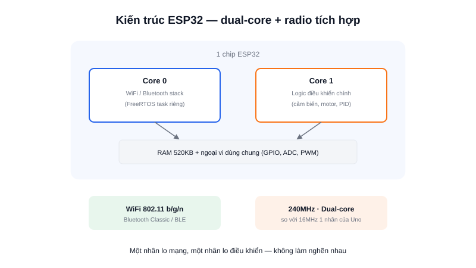

Nếu Arduino Uno là bước khởi đầu, **ESP32** thường là bước tiếp theo: cùng mức độ dễ lập trình (vẫn dùng được Arduino IDE), nhưng mạnh hơn hẳn về CPU, RAM, và có sẵn thứ Arduino gốc không có — WiFi và Bluetooth ngay trên chip, với giá thành rẻ hơn nhiều so với việc gắn thêm module không dây rời cho Arduino.



## Khái niệm chính

ESP32 là dòng vi điều khiển của hãng **Espressif** (Trung Quốc), lõi Xtensa LX6/LX7 (bản mới hơn dùng RISC-V), phổ biến nhất là bản **dual-core** — hai nhân CPU chạy song song, cho phép một nhân lo việc điều khiển thời gian thực trong khi nhân còn lại xử lý mạng mà không làm nghẽn nhau.

So với ATmega328P trên Arduino Uno, một ESP32 điển hình có:
- CPU 240MHz, 2 nhân (so với 16MHz, 1 nhân)
- 520KB RAM (so với 2KB)
- WiFi 802.11 b/g/n + Bluetooth Classic/BLE tích hợp sẵn
- Nhiều chân ADC/PWM/touch hơn, hỗ trợ FreeRTOS ngay trong SDK gốc

### Vì sao phù hợp cho robot cần kết nối không dây

Một AMR thực tế thường cần gửi dữ liệu telemetry (pin, tốc độ, trạng thái lỗi) lên dashboard, hoặc nhận lệnh điều khiển từ app điện thoại — ESP32 làm được việc này ngay mà không cần thêm module rời, đồng thời hỗ trợ **OTA (Over-The-Air) update**: nạp firmware mới qua WiFi thay vì phải cắm cáp USB mỗi lần.

> **Tóm lại:** ESP32 = Arduino dễ dùng + CPU mạnh hơn nhiều lần + WiFi/Bluetooth có sẵn, đổi lại giá cao hơn AVR thuần một chút và tiêu thụ điện lớn hơn khi bật radio.

## Nguyên lý hoạt động

```text
Nhân 0 (Core 0)              Nhân 1 (Core 1)
  WiFi / Bluetooth stack        Logic điều khiển chính
  (FreeRTOS task riêng)         (đọc cảm biến, điều khiển motor)
        │                              │
        └──────────── chia sẻ RAM, ngoại vi ─────────────┘
```

Ví dụ kết nối WiFi cơ bản bằng Arduino IDE:

```cpp
#include <WiFi.h>

void setup() {
  Serial.begin(115200);
  WiFi.begin("ten-wifi", "mat-khau");
  while (WiFi.status() != WL_CONNECTED) {
    delay(500);
  }
  Serial.println(WiFi.localIP()); // in địa chỉ IP nhận được
}
```

## Giới hạn cần biết

ADC trên ESP32 có độ tuyến tính không cao ở hai đầu dải đo, cần hiệu chỉnh nếu dùng để đọc cảm biến chính xác. Khi động cơ tạo nhiễu điện lớn trên cùng mạch nguồn, ESP32 có thể bị brown-out reset (tự khởi động lại) nếu nguồn không được lọc tốt — một lỗi hay gặp khi dùng ESP32 trực tiếp làm bo điều khiển chính cho robot có động cơ công suất lớn. Với vòng điều khiển thời gian thực cực kỳ khắt khe (PID tần số cao, độ trễ ngắt phải xác định tuyệt đối), **STM32** vẫn là lựa chọn đáng tin cậy hơn.
