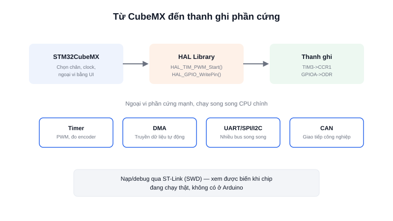

Nếu Arduino là điểm khởi đầu và ESP32 giải quyết bài toán kết nối không dây, thì **STM32** là lựa chọn khi cần một vòng điều khiển thời gian thực đáng tin cậy — đây là dòng chip xuất hiện trong rất nhiều bo mạch điều khiển động cơ, driver công nghiệp, và thiết bị y tế, không chỉ dừng ở dự án cá nhân.



## Khái niệm chính

STM32 là dòng vi điều khiển của hãng **STMicroelectronics**, xây dựng trên lõi **ARM Cortex-M** (M0, M0+, M3, M4, M7, M33...) — cùng một kiến trúc lõi được ARM thiết kế và nhiều hãng khác (NXP, TI...) cũng dùng, nên kỹ năng học trên STM32 chuyển sang các dòng ARM khác khá dễ dàng.

Điểm khác biệt lớn nhất so với Arduino/ESP32 là **cách tiếp cận**: STM32 không đi kèm một IDE "tất cả trong một" duy nhất, mà dùng bộ công cụ:
- **STM32CubeMX** — công cụ cấu hình chân, clock, ngoại vi bằng giao diện đồ hoạ, tự sinh code khởi tạo
- **HAL (Hardware Abstraction Layer)** — thư viện chuẩn của ST, tương tự vai trò `digitalWrite()` của Arduino nhưng chi tiết và mạnh hơn nhiều
- **ST-Link** — mạch nạp/debug rời, kết nối qua chuẩn SWD, cho phép đặt breakpoint và xem giá trị biến khi chip đang chạy thật — điều Arduino không hỗ trợ sẵn

### Vì sao chọn STM32 cho vòng điều khiển thời gian thực

STM32 có nhiều **Timer phần cứng** độc lập với CPU chính, hỗ trợ tạo PWM và đo tần số/xung encoder mà không tốn chu kỳ CPU để "đếm tay". Kèm theo đó là **DMA (Direct Memory Access)** cho phép truyền dữ liệu giữa ngoại vi và RAM mà không cần CPU can thiệp từng byte — quan trọng khi đọc liên tục dữ liệu từ IMU/encoder tốc độ cao trong lúc CPU vẫn phải chạy vòng lặp PID đúng chu kỳ.

> **Tóm lại:** STM32 đánh đổi độ dễ dùng ban đầu (cần công cụ, cần hiểu ngoại vi) để lấy hiệu năng, độ trễ ngắt thấp và ổn định — phù hợp khi lên bo điều khiển động cơ chính thức, không chỉ để thử nghiệm.

## Nguyên lý hoạt động

Việc cấu hình một ngoại vi trên STM32 thường đi qua 3 lớp, từ trừu tượng đến chi tiết:

```text
STM32CubeMX (chọn chân, clock, mode bằng UI)
        ↓ sinh code
   Code khởi tạo HAL (ví dụ: HAL_TIM_PWM_Init)
        ↓ gọi hàm
  Thanh ghi phần cứng thực tế (ví dụ: TIM3->CCR1)
```

Ví dụ bật một kênh PWM để điều khiển tốc độ động cơ bằng HAL:

```c
// Khởi động Timer 3 kênh 1 ở chế độ PWM
HAL_TIM_PWM_Start(&htim3, TIM_CHANNEL_1);

// Đổi độ rộng xung — CCR càng cao, motor quay càng nhanh
__HAL_TIM_SET_COMPARE(&htim3, TIM_CHANNEL_1, 750); // 0-1000 = 0-100%
```

## Giới hạn cần biết

Đường cong học tập của STM32 dốc hơn Arduino/ESP32 đáng kể: cần hiểu datasheet, reference manual, sơ đồ clock tree, và mua thêm mạch nạp ST-Link (dù giá rẻ, vài trăm nghìn đồng). Không có WiFi/Bluetooth tích hợp như ESP32 — nếu robot cần cả điều khiển thời gian thực lẫn kết nối mạng, kiến trúc phổ biến là **STM32 lo tầng điều khiển động cơ tần số cao, giao tiếp qua UART/CAN với ESP32 hoặc máy tính chạy ROS2 ở tầng cao hơn**.
