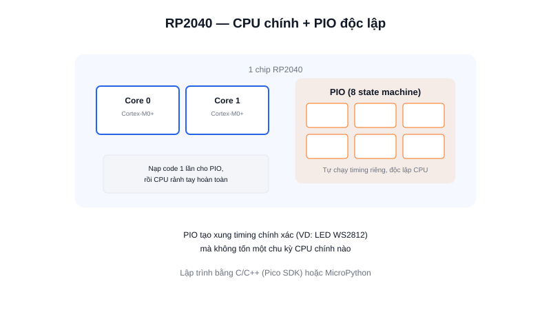

Cái tên "Raspberry Pi" thường gắn với những board chạy Linux đầy đủ (Raspberry Pi 4, 5...), nhưng **Raspberry Pi Pico** lại hoàn toàn khác: đây là một **vi điều khiển (MCU)** thực thụ, không chạy hệ điều hành, giá chỉ khoảng vài chục nghìn đồng, và mang một tính năng phần cứng khá độc đáo so với Arduino/ESP32/STM32.



## Khái niệm chính

Raspberry Pi Pico dùng chip **RP2040** — con chip đầu tiên do chính Raspberry Pi Foundation tự thiết kế (trước đó họ chỉ làm board, dùng chip của hãng khác). RP2040 có lõi kép **ARM Cortex-M0+**, 264KB RAM, và có thể lập trình bằng cả **C/C++ (Pico SDK)** lẫn **MicroPython** — phù hợp cho cả người quen Python lẫn người quen C nhúng.

Bản gốc (Pico) không có WiFi; bản **Pico W** thêm module WiFi (dùng chung chip CYW43439 như trên một số board khác), giá vẫn rất rẻ so với các lựa chọn tương đương.

### PIO — tính năng làm nên khác biệt

Điểm đặc biệt nhất của RP2040 là **PIO (Programmable I/O)**: 8 "máy trạng thái" nhỏ, độc lập hoàn toàn với CPU chính, có thể lập trình bằng một tập lệnh assembly cực đơn giản để tạo ra bất kỳ giao thức timing tuỳ chỉnh nào (điều khiển LED WS2812, giả lập một chuẩn giao tiếp lạ, đọc xung tần số cao...) mà **không tốn một chu kỳ CPU nào** để "đếm giờ" — CPU chính rảnh tay hoàn toàn trong lúc PIO tự chạy nền.

> **Tóm lại:** Pico = MCU rẻ, dual-core, lập trình linh hoạt (C/C++ hoặc MicroPython) + PIO cho phép tạo giao thức phần cứng tuỳ ý mà các MCU phổ thông khác không làm được.

## Nguyên lý hoạt động

```text
CPU chính (Cortex-M0+ x2)        PIO — 8 state machine độc lập
  Logic điều khiển, tính toán      Tự chạy chương trình assembly
        │                          riêng, sinh xung timing chính xác
        │                                    │
        └──────── nạp chương trình cho PIO 1 lần ─────────┘
                  rồi PIO tự chạy nền, không cần CPU can thiệp
```

Ví dụ khai báo với Pico SDK (C) — nạp một chương trình PIO rồi để nó tự chạy độc lập:

```c
PIO pio = pio0;
uint offset = pio_add_program(pio, &blink_program);
uint sm = pio_claim_unused_sm(pio, true);
blink_program_init(pio, sm, offset, PICO_DEFAULT_LED_PIN);
// Từ đây, PIO tự tạo xung nháy LED — CPU không cần vòng lặp delay() nào nữa
```

## Giới hạn cần biết

Cortex-M0+ là lõi ARM cấp thấp, hiệu năng tính toán thuần không bằng Cortex-M4/M7 trên STM32 dòng cao, và hệ sinh thái thư viện/cộng đồng chưa lớn bằng Arduino hay ESP32. PIO rất mạnh nhưng đòi hỏi học thêm tập lệnh assembly riêng của nó — không phải kiến thức có thể tái dùng ở nền tảng khác. Với robot AMR, Pico phù hợp cho các board phụ trợ giá rẻ (đọc cảm biến, tạo giao thức tuỳ chỉnh) hơn là đóng vai trò bo điều khiển động cơ chính.
