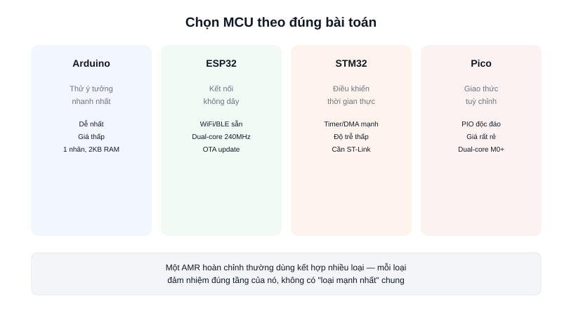

Sau khi đã biết riêng từng loại — Arduino, ESP32, STM32, Raspberry Pi Pico — câu hỏi thực tế nhất là: **với dự án đang làm, nên chọn cái nào?** Không có câu trả lời đúng tuyệt đối, chỉ có lựa chọn phù hợp nhất với đúng giai đoạn và yêu cầu của dự án.



## Khái niệm chính

Bốn nền tảng này không cạnh tranh trực tiếp mà giải quyết các bài toán khác nhau:

| Tiêu chí | Arduino Uno | ESP32 | STM32 | Pico (RP2040) |
|---|---|---|---|---|
| CPU | AVR 16MHz, 1 nhân | Xtensa 240MHz, 2 nhân | ARM Cortex-M, đến ~480MHz | Cortex-M0+, 2 nhân |
| RAM | 2KB | 520KB | Vài KB – vài trăm KB tuỳ dòng | 264KB |
| WiFi/Bluetooth | Không | Có sẵn | Không (cần module rời) | Không (Pico W thì có) |
| Nạp code | USB trực tiếp | USB trực tiếp | Cần ST-Link (SWD) | USB (kéo-thả file .uf2) |
| Timer/PWM/DMA | Cơ bản | Khá | Rất mạnh, nhiều kênh | Có PIO độc đáo |
| Giá tham khảo | Thấp | Rất thấp | Trung bình | Rất thấp |
| Độ khó | Dễ nhất | Dễ, gần như Arduino | Cao hơn, cần hiểu ngoại vi | Dễ, cần học riêng PIO nếu dùng |

### Nên chọn theo nhu cầu, không phải theo "loại mạnh nhất"

- **Cần thử ý tưởng thật nhanh, học khái niệm cơ bản** → Arduino
- **Robot cần gửi dữ liệu telemetry, điều khiển qua app/WiFi, OTA update** → ESP32
- **Bo điều khiển động cơ chính, cần vòng PID ổn định tần số cao, độ tin cậy công nghiệp** → STM32
- **Cần giao thức phần cứng tuỳ chỉnh, board phụ trợ giá cực rẻ** → Raspberry Pi Pico

> **Tóm lại:** Không hỏi "loại nào mạnh nhất", mà hỏi "bài toán đang cần giải là gì" — một AMR hoàn chỉnh thường dùng **kết hợp nhiều loại**, mỗi loại đảm nhiệm đúng vai trò của nó.

## Nguyên lý hoạt động

Trong một AMR thực tế, kiến trúc phổ biến kết hợp nhiều MCU theo tầng, mỗi tầng giao tiếp với tầng còn lại qua UART/CAN/I2C:

```text
STM32 (tầng thấp)
  Vòng PID tần số cao, đọc encoder, điều khiển motor
        │  UART / CAN
        ▼
ESP32 hoặc máy tính nhúng (tầng giữa)
  Gửi telemetry qua WiFi, nhận lệnh, giám sát trạng thái
        │
        ▼
Máy tính chạy ROS2 (tầng cao)
  SLAM, path planning, ra quyết định
```

Arduino và Pico thường xuất hiện ở giai đoạn **thử nghiệm** trước khi thiết kế chính thức chuyển sang STM32/ESP32 cho độ tin cậy và khả năng mở rộng lâu dài.
